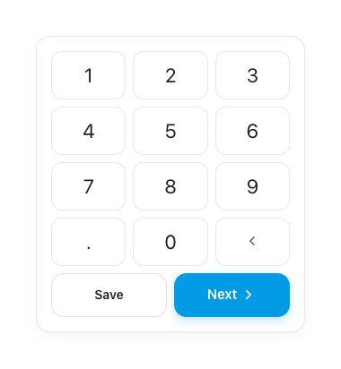
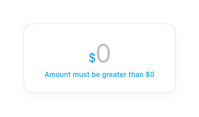

# Amount Entry — Keypad & Validation

The amount-entry primitive auto-opens on the Add screen so logging takes under 5 seconds.

> **Type:** display amount + Inter keys follow [tokens.md §2a — Titles & Amounts (Android)](../tokens.md#2a-android-spec--titles--amounts-instrument-serif).

## Keypad
- 3-column grid, gap 8dp, card padding 16dp, max width 300dp.
- **Money keys use Inter** (money is always serif): Inter 22sp, `ink`, on white cards (1dp `line`, radius 12dp, padding 13dp vertical).
- Keys: `1–9`, `.`, `0`, `⌫` (backspace = `back` icon, 18dp, `ink2`).
- Two thumb-range actions below, gap 8dp, radius 14dp, padding 14dp:
  - **Save** — secondary (transparent, 1.4dp `lineStrong`, `ink`, 600) — quick-log.
  - **Next** — primary (`clay`, `#FFFDF6`, 600) with trailing `chevron-right`; shadow `0 4px 10px rgba(3,155,229,.25)`.

## Validation

- Display amount: Inter, `muted2` when zero; the `$` glyph stays `clay`.
- Below-threshold (`≤ $0`): helper text `clay`, both actions drop to `alpha 0.55`, and the field **shakes** (±4dp, 280ms) on submit attempt.
- Max display: `999,999,999.99`. Thousands grouped with commas as you type.

## Behavior
**Input rules** (applied on every key):
- **Digits** append to the amount. Whole part capped at **7 digits**; fractional part capped at **2 digits** (further input ignored).
- **`.`** inserts a single decimal point; if the field is empty it becomes `0.`. A second `.` is ignored.
- **`⌫`** deletes the last character.
- **Leading zeros** are stripped unless immediately followed by a decimal (`0.` stays).
- Display formats live: thousands grouped with commas, the decimal part rendered in `ink3`, the `$` glyph held in `clay`, and the whole figure in `muted2` while empty (placeholder).

**Validation & actions:**
- `canProceed = value > 0`. While `≤ $0`, **Save** and **Next** are disabled (`alpha 0.55–0.6`, Next loses its shadow + uses `claySoft`).
- Tapping a disabled action triggers a **shake** (±4dp, ~320ms) and reveals helper text *"Amount must be greater than $0"*.
- **Next** → advances to the Details screen. **Save** → quick-commits the expense, returns home (`slide-back`), and fires the success toast.

**Draft persistence:** any non-empty amount marks an in-progress draft (persisted). On relaunch with a saved draft, a **restore prompt** offers *Continue* (resume at amount) or *Discard*.

## Compose notes
Custom composable — no M3 keypad exists. `LazyVerticalGrid(columns = Fixed(3))` or nested `Row`s of weighted key cells; each key is a `Surface(onClick)` with Inter `Text`. Hoist amount state as a `String`; format with a grouping `NumberFormat`. Drive shake with an `Animatable` offset. Disable actions when `amount.toDoubleOrNull() ?: 0.0 <= 0`.
