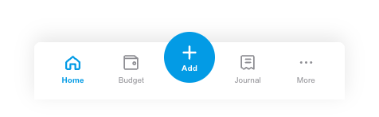
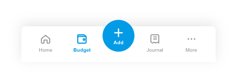

# Bottom Navigation

A floating, glass-blur tab bar with a raised central **Add** button — five slots: Home, Budget, **Add**, Journal, More.

## Bar
- Background `rgba(255,255,255,0.86)` over a **`blur(22px) saturate(180%)`** backdrop.
- Top corners **8dp**, padding `8 × 12 × 16` dp.
- Shadow `0 -6px 24px rgba(0,0,0,.10)` + inset top hairline `rgba(255,255,255,.7)`.
- Tabs share equal weight (`Modifier.weight(1f)`).

## Tab item
| State | Icon | Label |
|---|---|---|
| Active | `blue500`, 25dp, stroke **2.1** | 10sp / 600, `blue500` |
| Inactive | `#8E8E93`, 25dp, stroke **1.7** | 10sp / 500, `#8E8E93` |

Label sits 4dp under the icon (`Column`, padding `5 × 0 × 3`).

## Add (center)
- 64dp circle, `blue500`, 3dp border `rgba(3,155,229,.8)`, **raised −24dp** above the bar.
- `plus` glyph 26dp stroke 2.4 (`white`) + 10sp/600 "Add" label, white.

## Behavior
- **Tab tap** switches the active tab — updates the active colour *and* bumps the icon stroke (1.7 → 2.1) and label weight (500 → 600). Only one tab active at a time.
- The bar is shown **only on top-level screens**; it is hidden during the add/edit flow (the screen owns its own footer CTA instead).
- **Center Add** starts a **fresh** add flow — it resets the working draft to empty before navigating, regardless of the current tab.
- The bar floats above scrolling content with a blur backdrop; content scrolls beneath it (add bottom content padding so the last row clears the bar).

## Compose notes
M3 `NavigationBar` covers the four tabs (`NavigationBarItem`, `indicatorColor = Transparent`, selected = blue500, unselected = `#8E8E93`) — but the **raised center FAB** and the glass blur are custom. Build as a `Box`: a blurred `Surface` bar (`Modifier.blur` / `RenderEffect` for the backdrop on API 31+) with a `FloatingActionButton` offset `y = (-24).dp` in the center. Bump active stroke weight, not just colour.
