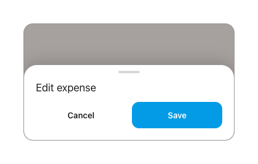

# Bottom Sheet

Slides up over a scrim for create / edit flows.

- Scrim: `rgba(43,31,23,0.42)`, fades in 200ms.
- Sheet: `card` white, **top corners 22dp**, shadow `0 -8px 24px rgba(0,0,0,.15)`, max-height 78%.
- **Grab handle:** 36 × 4 dp pill, `rgba(43,31,23,.18)`, centered, margin `10 / auto / 14`.
- Title: Inter 18sp.
- Footer actions: two buttons, gap 10dp, each `weight(1f)` — typically `ghost` Cancel + `primary` Save.

## Motion
- Enter: `sheet-up` from `translateY(100%)`, **340ms**, `cubic-bezier(.22,.61,.36,1)`.

## Behavior
- Opens with `sheet-up` (340ms) over the scrim. Dismiss via **scrim tap**, **close button**, or **swipe-down** on the handle.
- Content **scrolls internally** within the 78% max-height; the handle + title stay pinned.
- Selecting an item generally **applies and closes** in one tap (no separate confirm), except multi-field sheets which close on an explicit **Apply**.
- Sheet-specific rules:
  - **Tag picker** — event *or* debt are **mutually exclusive**: choosing from one group greys out (and disables) the other until cleared.
  - **Category picker** — grid single-select; selecting closes and updates the draft category.
- **Date & time is no longer a bottom sheet** — it's a full-screen page (`PickerScreenShell`), not
  this component. See [date-time-picker.md](date-time-picker.md).

## Compose notes
M3 `ModalBottomSheet` (`sheetState`, `shape = RoundedCornerShape(topStart = 22.dp, topEnd = 22.dp)`, `containerColor = white`, `scrimColor = Color(0xFF2B1F17).copy(alpha = .42f)`). Replace the default drag handle with the 36×4dp pill, or pass a custom `dragHandle`. The 340ms curve matches the M3 default closely; override via `sheetState` if needed.
