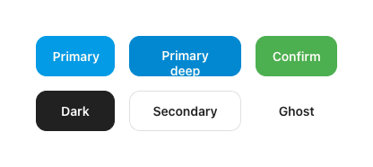
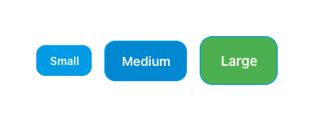
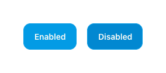

# Button

Primary action control. Six variants × three sizes, all sharing one shape language and a press-scale of 0.97.

## Variants
| Variant | Container | Label | Border | M3 mapping |
|---|---|---|---|---|
| `primary` | `blue500` | `#FFFDF6` | 1.4dp `blue500` | `Button` (filled) |
| `primary-deep` | `blue700` | `#FFFDF6` | 1.4dp `blue700` | `Button`, container = blue700 |
| `sage` | `green500` | `#FFFDF6` | 1.4dp `green500` | `Button`, container = green500 |
| `dark` | `ink` `#212121` | `paper` | 1.4dp `ink` | `Button`, container = ink |
| `secondary` | transparent | `ink` | 1.4dp `lineStrong` | `OutlinedButton` |
| `ghost` | transparent | `ink` | 1.4dp transparent | `TextButton` |

## Sizes

| Size | Padding (v×h) | Font | Radius |
|---|---|---|---|
| `sm` | 8 × 14 dp | 12sp | 10dp |
| `md` | 12 × 18 dp | 14sp | 12dp |
| `lg` | 16 × 22 dp | 15sp | 14dp |

- Font: **Manrope 600**, tracking `-0.005em`.
- `fullWidth` → `Modifier.fillMaxWidth()`.

## States

- **Pressed:** `scale(0.97)`, opacity 0.92, 80ms ease.
- **Disabled:** `alpha = 0.4f`, no click. (Below-threshold actions in the keypad use `alpha 0.55`.)

## Behavior
- **Stateless action trigger** — emits a single `onClick` per tap; holds no internal toggle/loading state.
- **Press:** animates to `scale 0.97` + `opacity 0.92` over 80ms on press-down, reverts on release. Drive from `interactionSource`, not a click delay.
- **Disabled:** `onClick` is suppressed, pointer events ignored, `alpha 0.4`. The keypad's Save/Next reuse this at `alpha 0.55–0.6` while the amount is `≤ $0`.
- **Full-width** buttons (`fullWidth`) stretch to the parent; otherwise width hugs content.
- No ripple — feedback is the scale/opacity dip only. Keep M3 ripple disabled or replace its indication.

## Compose notes
Custom `ProButton(variant, size, enabled, fullWidth, onClick)` wrapping the matching M3 button. Override `ButtonDefaults.buttonColors`, `contentPadding`, and `shape = RoundedCornerShape(radius)`. `onPrimary` is warm white `#FFFDF6`, **not** pure white. Press-scale via `interactionSource`.
