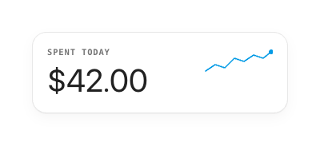

# Card & Surfaces

White cards float on warm paper with a hairline border and a soft two-layer shadow. Radius scales with element size.

## Card
- Background `card` `#FFFFFF`, border **1dp `line`**, radius **16–18dp**, padding **18dp**.
- Shadow: `0 1px 0 rgba(33,33,33,.03)`, `0 6px 16px rgba(33,33,33,.04)` — subtle, never tonal.
- Example anatomy: mono eyebrow (`ink3`, uppercase, tracking 0.08em) → Inter amount (40sp, `-0.02em`) → optional inline sparkline (`clay`, 1.6dp stroke).

## Radius scale
| Element | dp |
|---|---|
| Chip / pill | 99 (full) |
| Quick-access / field | 14 |
| Card | 16–18 |
| Sheet | 22 |
| Phone body | 54 |

## Behavior
- The home **context card is tappable** to cycle the header persona `casual → budget → event` (demo affordance); make whole-card tap targets explicit when a card is actionable, else render it static.
- **Progress bars** fill to `min(100%, spent / budget)`; the budget persona also shows `% used` and `amount left`, the event persona shows `days left`.
- Cards never change elevation on press — only the optional scale-tap feedback if interactive.

## Compose notes
M3 `Card` / `Surface` with `containerColor = white`, `tonalElevation = 0.dp`, `shape = RoundedCornerShape(18.dp)`, plus a `Modifier.border(1.dp, line, shape)`. Render the shadow with `Modifier.shadow(6.dp, shape, spotColor = Color(0xFF212121).copy(alpha=.04f))` *before* the background, or a custom soft shadow — keep it lighter than M3 defaults.
