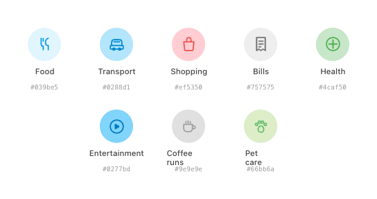
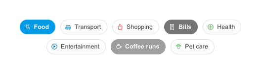

# Category — Badge & Chip

Every expense maps to a category, each with a dedicated icon, accent colour and matching tint. **Badges** appear in list rows (read-only); **chips** drive selection.

## Catalogue
| id | Label | Accent | Tint | Custom |
|---|---|---|---|---|
| `food` | Food | `#039BE5` | `#E1F5FE` | — |
| `transport` | Transport | `#0288D1` | `#B3E5FC` | — |
| `shopping` | Shopping | `#EF5350` | `#FFCDD2` | — |
| `bills` | Bills | `#757575` | `#EEEEEE` | — |
| `health` | Health | `#4CAF50` | `#C8E6C9` | — |
| `entertainment` | Entertainment | `#0277BD` | `#81D4FA` | — |
| `coffee` | Coffee runs | `#9E9E9E` | `#E0E0E0` | ✓ |
| `pet` | Pet care | `#66BB6A` | `#DCEDC8` | ✓ |

## Badge

- Circular: `size` dp, `borderRadius = 50%`, background = category **tint**, glyph = category **accent**.
- Default sizes: **38dp** in rows, **48dp** in pickers. Icon = `round(size × 0.52)`, stroke 1.7dp.
- Compose: `Box(Modifier.size(size).clip(CircleShape).background(tint))` + centered `Icon(tint = accent)`. No M3 equivalent.

## Chip (selectable)

| State | Container | Label | Border | Weight |
|---|---|---|---|---|
| Idle | transparent | `ink2` | 1.2dp `lineStrong` | 500 |
| Selected | category **accent** | `#FFFDF6` | 1.2dp accent | 600 |

- Padding `7×12×7×8` dp, radius **99 (full)**, font 12.5sp, gap 6dp, leading icon 14dp.
- Compose: M3 `FilterChip` with `FilterChipDefaults.filterChipColors(selectedContainerColor = accent, …)` and `shape = CircleShape`; or custom `Row`. Keep the leading category icon in both states (accent when idle, warm-white when selected).

## Behavior
- **Badge** is presentational only — never interactive.
- **Chip** belongs to a **single-select group**: tapping a chip selects it and deselects whichever was active (exactly one category per expense). There is no toggle-off — a category is always chosen (default `food`).
- Selection is immediate (no confirm) and updates the draft's `category`.
- On selection the chip swaps to **accent fill / 600 weight / warm-white glyph**; deselected chips return to the outline style.
- A trailing **"+ More" / "+ Add"** affordance opens the Category Picker bottom sheet; picking there closes the sheet and selects that category.
