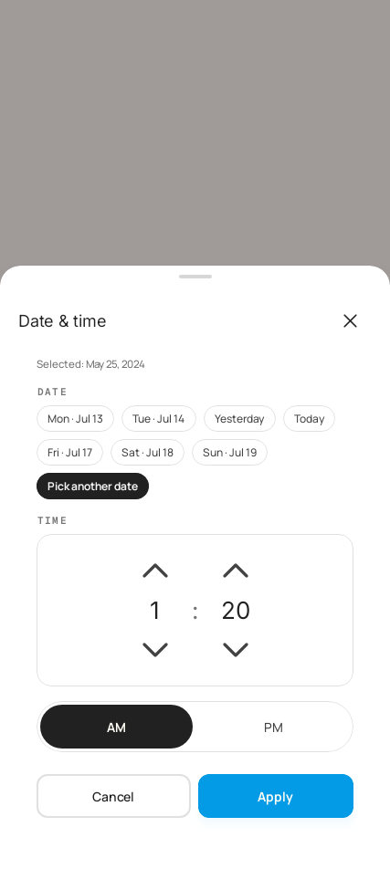

# Date & Time Picker

Quick-pick date chips + a tap-to-step time spinner, for setting an expense/debt/event date without
typing or a full calendar grid. Matches the Claude Design project's `DateTimeSheet`
(`flow-01-screens.jsx`) — see [dev sign-off](../dev-signoff/date-time-picker-signoff.md) for the
fidelity verification against that source.

- **Date section**: an uppercase mono "DATE" eyebrow label (`typography.eyebrow`), then 7
  `FilterChip`s, `today − 3` … `today + 3`, laid out in a `FlowRow` that wraps to as many lines as
  needed (not a scrolling row). Near days read "Today" / "Yesterday"; the rest read `EEE · MMM d`.
  A trailing chip ("Pick another date") opens a full calendar as a fallback for dates outside the
  7-day window — necessary because this sheet also edits older records (a debt due date, a past
  expense) that routinely fall outside it; this affordance has no equivalent in the source mockup,
  which only ever needs its fixed 6-date demo range. When the selected date isn't one of the 7
  chips, none of them show selected and a small header line above the row states the resolved date
  instead.
- **Time section**: an uppercase mono "TIME" eyebrow label, then a single bordered, card-shaped box
  containing both steppers — hour (1–12) and minute (00–59), each a chevron-up / big number /
  chevron-down stack — separated by a centered ":" glyph, matching the mockup's unified time box
  (rather than two separate bordered containers). Single tap = ±1, wrapping at the ends. Below the
  box, an AM/PM segmented toggle — a deliberate deviation from the mockup's cramped vertical
  stacked buttons, reusing the existing full-width `SegmentedToggle` for a larger touch target and
  design-system consistency.
- **Future-date notice**: when the resolved date is after today, a `primaryTint`-background info
  row appears above the action buttons ("entries are ordered by created date, not expense date").
- Footer: two buttons, gap 8dp, each `weight(1f)` — `Secondary` Cancel + `Primary` Apply. Unlike
  most sheets, selecting a chip or stepping a spinner does **not** auto-close — the sheet closes
  only on Apply or Cancel.

## Motion
- Inherits the bottom sheet's `sheet-up` enter (see [bottom-sheet.md](bottom-sheet.md)).
- Chip selection uses the same press-scale as any other `FilterChip`; no bespoke motion beyond that.

## Behavior
- Tapping a date chip or a spinner chevron only updates local sheet state — it does not commit or
  close the sheet.
- The fallback calendar dialog commits its own selection back into the sheet's date state
  immediately on tap, then closes itself; the outer sheet still requires its own Apply to commit.
- Apply combines the selected day + hour/minute/AM-PM into one epoch-millis value and closes the
  sheet; Cancel discards all local changes.

## Compose notes
Custom composable (`DateTimePickerSheet`, `shared/.../ui/design/DateTimePickerSheet.kt`) hosted in
`ProBottomSheetHost`. Date chips reuse `FilterChip` (`Fields.kt`); the "DATE"/"TIME" eyebrows reuse
a small private `SectionEyebrow` wrapper around `typography.eyebrow` (the same token
`CardSurfaces.kt` uses for its own uppercase mono labels); AM/PM reuses `SegmentedToggle`. Because
the date chips wrap instead of scrolling, there's no horizontal-scroll edge-fade affordance on this
row (unlike `CategoryNewSheet.kt`'s `verticalFadingEdge`, which applies to an actually-scrolling
list). The fallback calendar reuses the M3 `DatePicker` + `proDatePickerColors()`/
`proDatePickerTypography()` (`DatePickerTheming.kt`) inside a scrim-backed `Surface` overlay,
matching `ProAlertDialog`'s visual language rather than a system `Dialog`.
