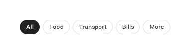

# Filter Chip

Single-select segment filter for lists (Journal, Search). Distinct from category chips: monochrome, ink-filled when active.

| State | Container | Label | Border | Weight |
|---|---|---|---|---|
| Idle | transparent | `ink2` | 1dp `lineStrong` | 500 |
| Active | `ink` `#212121` | `paper` | 1dp `ink` | 600 |

- Padding **6 × 12 dp**, radius **99 (full)**, font 12sp, `whiteSpace: nowrap`.
- Row gap 6dp; horizontally scrollable when overflowing.
- A trailing **"More"** chip opens the full category sheet.

## Behavior
- **Single-select group**: tapping a chip activates it and deactivates the rest. **"All"** is the default active state.
- Selection **filters the list immediately** — there is no Apply step.
- The row **scrolls horizontally** when chips overflow; the active chip does not auto-scroll into view.
- A trailing **"More"** chip opens the full category sheet rather than acting as a filter value.

## Compose notes
M3 `FilterChip` (single-selection group) with `selectedContainerColor = ink`, `selectedLabelColor = paper`, `shape = CircleShape`, `border = FilterChipDefaults.filterChipBorder(borderColor = lineStrong)`. Lay out in a `LazyRow(horizontalArrangement = Arrangement.spacedBy(6.dp))`.
