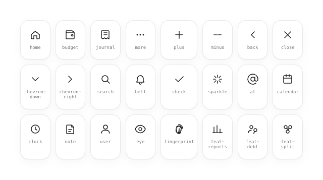

# Iconography

One stroke-based set on a **24×24 grid**, **1.6dp** stroke (2.0–2.4 when active/primary), rounded caps and joins throughout.

## Groups
- **Navigation & chrome:** `home` `budget` `journal` `more` `plus` `minus` `back` `close` `chevron-down` `chevron-right` `search` `bell` `check`
- **Detail & meta:** `sparkle` `at` `calendar` `clock` `note` `user` `eye` `fingerprint`
- **Categories:** `cat-food` `cat-transport` `cat-shopping` `cat-bills` `cat-health` `cat-entertainment` `cat-coffee` `cat-pet` `cat-default`
- **Feature shortcuts:** `feat-reports` `feat-debt` `feat-split` `feat-events`

## Rules
| Property | Value |
|---|---|
| Grid / viewBox | 24 × 24 |
| Default stroke | 1.6dp |
| Active / primary stroke | 2.0–2.4dp |
| Caps & joins | round |
| Fill | none (stroke only); dots in `more` are filled |
| Default size | 22–25dp (nav 25, list 16–18, chips 14) |

## Behavior
- Purely **presentational** — icons carry no interaction of their own; the tappable target is the parent (button, chip, tab, row).
- **Tint inherits** `currentColor` / the `tint` passed by the host; category glyphs use their catalogue accent.
- **Active / primary** contexts increase `strokeWidth` (1.6 → 2.0–2.4) rather than only changing colour — bake or parameterise the heavier weight.

## Compose notes
Author each as an `ImageVector` (`materialIcon { materialPath { … } }`) or load from bundled vector drawables — **`stroke`-based**, so keep `strokeWidth`, `strokeLineCap = Round`, `strokeLineJoin = Round` and `fill = null`. Tint via `Icon(tint = …)`. Active states bump `strokeWidth`, not just colour — bake two weights or parameterise the vector. Category accents come from the catalogue in `category.md`.
