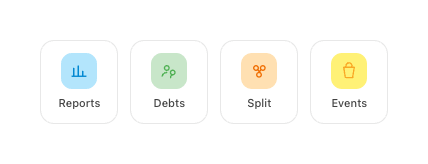

# Quick-Access Tiles

Feature shortcuts on the Home screen — a 4-up grid of labelled icon tiles.

- Tile: `Column(CenterHorizontally)`, white card, 1dp `line`, radius **14dp**, padding `12 × 4` dp, gap 7dp.
- Icon chip: 36dp square, radius **11dp**, background = feature tint, glyph 18dp stroke 1.8.
- Label: Manrope 11sp / 500, `ink2`.

| Tile | Tint | Glyph stroke | Icon |
|---|---|---|---|
| Reports | `blue100` | `blue700` | `feat-reports` |
| Debts | `#C8E6C9` | `green500` | `feat-debt` |
| Split | `tagTint` | `tagDeep` | `feat-split` |
| Goals *(renamed from "Events")* | `yellow300` | `#F9A825` | `feat-events` |

## Behavior
- Each tile **navigates to its feature** (Reports / Debts / Split / Goals) on tap, with the standard `scale 0.97` press feedback.
- The **"Customize"** affordance in the section header is now **live** — it opens a picker sheet where the user can toggle which tiles are visible (at least one must stay enabled) and reorder the remaining tiles via up/down chevrons. Choices persist to `SharedPreferences` (`quick_access_prefs` / `tile_order`), so the grid is no longer a fixed, non-configurable four.
- Tiles still hold no selected/toggle state during normal navigation — only the Customize sheet has interactive state.

## Compose notes
`Row` of four `Modifier.weight(1f)` tiles (or `LazyVerticalGrid` Fixed(4)), each a `Surface(onClick, shape = RoundedCornerShape(14.dp))`. The inner icon chip is a `Box(Modifier.size(36.dp).clip(RoundedCornerShape(11.dp)).background(tint))`. Note the chip radius (11dp) differs from the tile radius (14dp).
