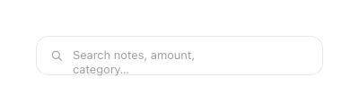
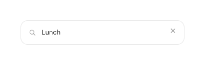

# Search Field

Read-as-input field for Journal / Search. Display-only styling (the live field opens a text cursor).

| | Spec |
|---|---|
| Container | `card` white, 1dp `line`, radius **14dp**, padding `12 × 14` dp |
| Leading | `search` icon 16dp, `muted`, stroke 1.7 |
| Placeholder | Manrope 13sp, `muted` — "Search notes, amount, category…" |
| Filled text | Manrope 13sp, `ink` |
| Trailing (filled) | `close` icon 15dp, `muted` — clears the query |
| Layout | `Row(CenterVertically)`, gap 10dp |

## Behavior
- **Tap** focuses the field and shows the text cursor; typing **filters the list live** (no submit / enter step).
- The **clear (×)** trailing icon appears only when the query is non-empty; tapping it empties the query and keeps focus.
- Placeholder text shows whenever the field is empty. The field has no focus ring — the cursor is the only focus signal.

## Compose notes
M3 `OutlinedTextField` is heavier than needed — prefer a custom `Row` inside a `Surface(shape = RoundedCornerShape(14.dp), border = BorderStroke(1.dp, line))` wrapping a `BasicTextField`. Show the trailing clear `IconButton` only when `query.isNotEmpty()`. Background stays white; no focus ring — focus is signalled by the cursor only.
