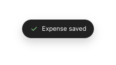

# Toast

Transient confirmation — a dark rounded pill that rises, holds, and auto-dismisses.

- Container `ink` `#212121`, text `paper`, radius **99 (full)**, padding `10 × 16` dp.
- Font Manrope 13sp; gap 8dp; leading status icon (e.g. `check` 16dp, **`green300`** stroke 2.2 for success).
- Shadow `0 8px 18px rgba(0,0,0,.18)`. Positioned ~100dp from the bottom, centered.

## Motion
- `toast-up`: fade + rise in (15%), hold, fade out — total **2400ms**, then auto-removes.

## Behavior
- Fired after a successful commit (e.g. *"Saved $12.40 to Food"*). **Non-interactive** and **auto-dismisses after ~2500ms**.
- A new toast **replaces** any currently-showing toast (single toast at a time); the dismiss timer resets on replace and is cleared if the host unmounts.
- Informational only in the default success case — no action button.

## Compose notes
M3 `Snackbar` host with a **custom `Snackbar`** composable: `containerColor = ink`, `contentColor = paper`, `shape = CircleShape`, leading icon coloured per status (success = green300, error = danger). Show via `SnackbarHostState.showSnackbar(duration = Short)`. It is informational only — no action button in the default success case.
