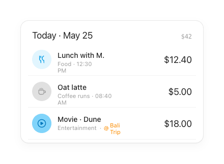

# Transaction Row & Day Group

The core list unit. Transactions are grouped under a day header carrying a Inter date and a mono running total.

## Day group header
- `Row(SpaceBetween)`, padding `12 × 8 × 6` dp.
- Left: **Inter 18sp**, tracking `-0.01em` (e.g. "Today · May 25").
- Right: **Geist Mono 12sp**, `muted` — the day's total (e.g. "$42").

## Transaction row
`Row`, vertical padding 12dp, horizontal 8dp, gap 12dp, bottom border 1dp `line2`.

| Slot | Spec |
|---|---|
| **Leading** | Category badge, 38dp (see `category.md`) |
| **Note** | Manrope 14sp / 500, `ink` |
| **Meta** | Manrope 11.5sp, `muted` — "Category · time" |
| **Tag** *(optional)* | `tag` orange `#FB8C00`, prefixed by 10dp `at` icon |
| **Amount** | Inter 18sp, `ink`, right-aligned |

> **Type:** Inter amount + day header follow [tokens.md §2a — Titles & Amounts (Android)](../tokens.md#2a-android-spec--titles--amounts-instrument-serif).

- Money uses **Inter**. The event tag is the only warm accent in the row.

## Behavior
- **Tap a row** to open its edit bottom sheet.
- **Note fallback:** when `note` is empty the row shows the category label instead; long notes truncate with ellipsis on one line.
- **Meta line** reads `category · time`, appending the orange event tag only when the txn is linked to an event.
- **New row:** a freshly committed expense is inserted at the top and animates with a `clayTint → transparent` highlight pulse over **1800ms** (then clears).
- The day header is a plain group label (not sticky); the running total reflects only that day's rows.

## Compose notes
Custom row (not M3 `ListItem` — the two-line text block + Inter trailing amount don't map cleanly). `Row(verticalAlignment = CenterVertically)`; note/meta in a weighted `Column(Modifier.weight(1f))`; amount as trailing `Text`. Dividers via `Modifier.drawBehind` or `HorizontalDivider(color = line2)`. New rows pulse `clayTint → transparent` over 1800ms on insert.
