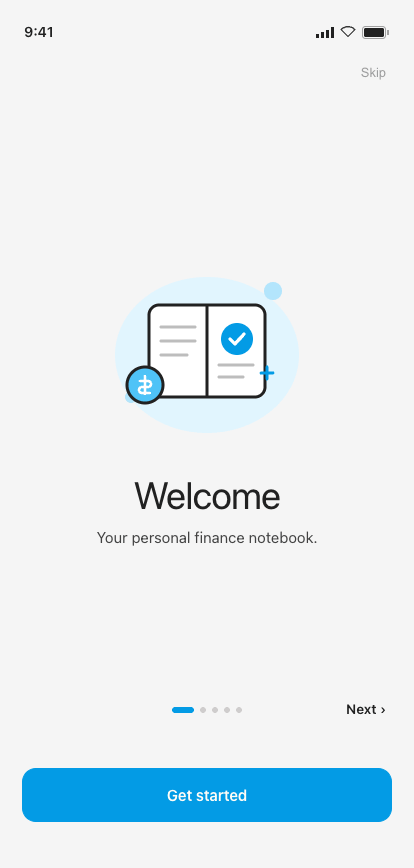
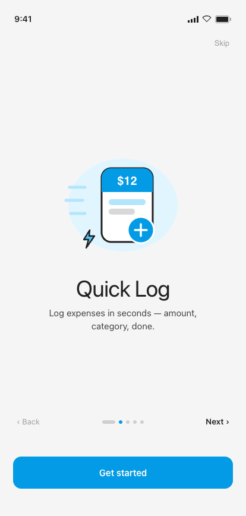
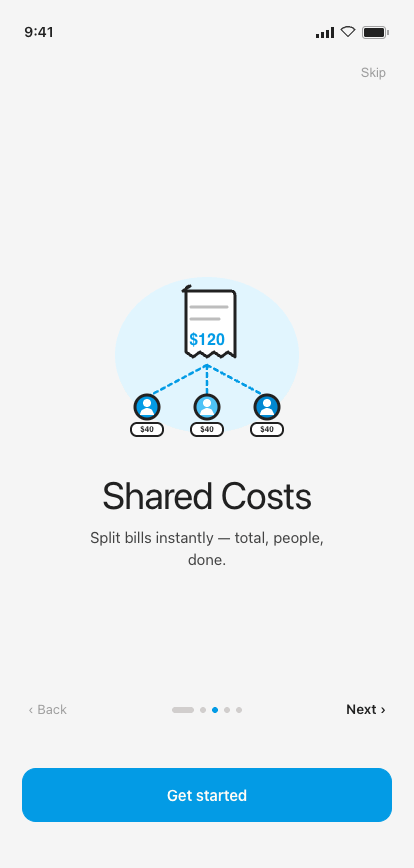
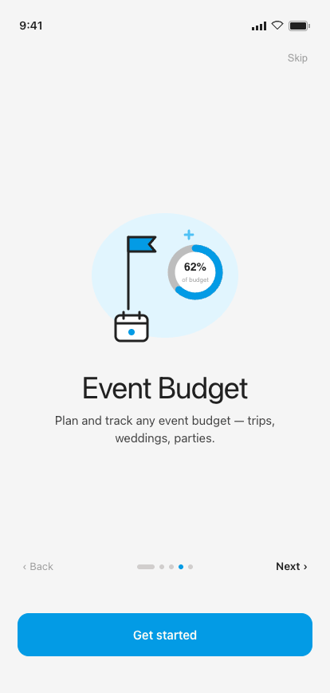
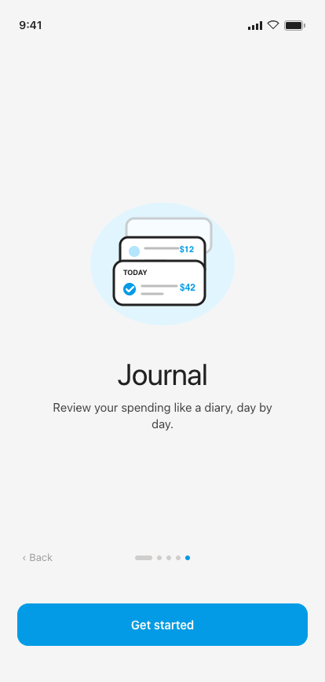

# 02 · Onboarding

**Flow:** First launch  
**Purpose:** Five swipeable slides introducing MVP features. First launch only.

---

## States

### 1 · Welcome

### 2 · Quick Log

### 3 · Shared Costs

### 4 · Event Budget

### 5 · Journal

## Behavior & interactions

- Horizontally swipeable; the page-dot indicator tracks position (active dot widens to 22dp).
- Skip (top-right) is present on every slide except the last; it jumps straight to Profile Setup → Home.
- “Get started” CTA is bottom-anchored and present on EVERY slide — an eager user can start from anywhere.
- Back appears from slide 2 onward; Next is hidden on the last slide.
- No use-case selection — features are discovered, not chosen.

## Component composition · M3 mapping

| Component | Role | Compose / M3 |
|---|---|---|
| Soft-illustrated hero | One pastel illustration per slide | `Image` |
| Page indicator | 5 dots, active widens | `custom Row + animateDpAsState` |
| Button (primary, lg, fullWidth) | “Get started” CTA | `Button` |
| Text button | Skip / Back / Next | `TextButton` |

## Tokens applied

**Type**

- Slide title — Instrument Serif 38sp / -0.02em (white-space: nowrap)
- Body — Manrope 15sp / 1.45 ink2
- Nav labels — Manrope 13sp

**Color**

- active dot = clay #039BE5
- idle dot = rgba(43,31,23,.18)
- illustration palette: blue100 #B3E5FC tints

**Shape · spacing**

- Illustration box 280dp
- CTA = Button lg (radius 14dp)
- nav row marginBottom 48dp clears CTA

---

## Foundations (shared reference)

Applies to every screen. Full source: [`../tokens.md`](../tokens.md) · component specs in [`../components/`](../components/).

### Type — three families, one job each

| Role | Family | Size / Line | Tracking | Weight |
|---|---|---|---|---|
| Display amount | Instrument Serif | 64 / 64 | -0.025em | Regular |
| Card amount | Instrument Serif | 40 / 40 | -0.02em | Regular |
| Hero greeting | Instrument Serif | 30 / 32 | -0.015em | Regular |
| Sheet title | Instrument Serif | 22 / 24 | -0.01em | Regular |
| Section / day head | Instrument Serif | 18 / 20 | -0.01em | Regular |
| Screen header / app-bar | Instrument Serif | 17 / 20 | 0 | Regular |
| Body / emphasis / button | Manrope | 14 / 1.4 | 0 / -0.005em | 400–600 |
| Caption | Manrope | 11.5 / 1.4 | 0 | 400–500 |
| Eyebrow / label | Geist Mono | 11 / 1.3 | 0.10–0.12em (upper) | 500–600 |
| Timestamp / figures | Geist Mono | 11.5–12 | 0.04em | 400–500 |

> Amounts are **always Instrument Serif**. Compose: `PlatformTextStyle(includeFontPadding = false)` + `LineHeightStyle(Center, Both)` on every title/amount; Instrument Serif ships **Regular + Italic only — never request bold**. The `$` glyph is ≈0.47× the figure in `clay`; decimals (`.00`) sit in `ink3`.

### Color

**Primary — Material blue**

| Token | Hex | Role |
|---|---|---|
| `blue100` / clayTint | `#B3E5FC` | Tint behind icons, active wash |
| `blue300` / claySoft | `#4FC3F7` | Soft accent |
| `blue500` / **clay** | `#039BE5` | **Primary** — actions, active nav, FAB, links, amount accents |
| `blue700` / clayDeep | `#0288D1` | Pressed / deep primary |

**Signal hues**

| Token | Hex | Role |
|---|---|---|
| `green500` / sage | `#4CAF50` | Success, on-track, **I Lent** |
| `sageTint` | `#C8E6C9` | Success badge tint |
| `red400` / danger | `#EF5350` | Destructive, over-budget, **I Owe** |
| `dangerTint` | `#FFCDD2` | Danger badge tint |
| `tag` | `#FB8C00` | **Event @-tags** — the one warm signal |
| `tagTint` | `#FFE0B2` | Tag tile tint |

**Budget progress system**

| Range | State | Color |
|---|---|---|
| 0–100% | On track | soft blue `#B3D4E8` |
| 101–110% | Over budget | warm yellow `#F5E6A3` |
| 110%+ | Significantly over | soft red `#E07070` |

**Neutrals & semantic**

| Token | Hex | Role |
|---|---|---|
| `paper` | `#F5F5F5` | App background |
| `card` / white | `#FFFFFF` | Cards, sheets, nav, fields |
| `ink` | `#212121` | Primary text |
| `ink2` | `#424242` | Secondary text |
| `ink3` | `#757575` | Captions, labels |
| `muted` | `#9E9E9E` | Placeholders |
| `muted2` | `#BDBDBD` | Disabled glyph / empty amount |
| `lineStrong` | `#E0E0E0` | Outlined borders |
| `line` | `rgba(33,33,33,.10)` | Card & row borders |
| `line2` | `rgba(33,33,33,.06)` | Inner dividers |

### M3 ColorScheme & Typography mapping

- `primary` = blue500 `#039BE5` · **`onPrimary` = warm white `#FFFDF6`** (not pure white) · `surface` = white · `background` = paper · `onSurface` = ink · `onSurfaceVariant` = ink3 · `outline` = lineStrong · `outlineVariant` = line · `error` = danger · `tertiary` = tag.
- Success / highlight / budget-progress colors have **no M3 slot** — expose via a custom `ProColors` object.
- `displayLarge` → display amount · `headlineMedium` → screen title · `titleMedium` → section head · `bodyMedium` → body · `labelMedium` → eyebrow · `bodySmall` → caption.

### Shape · spacing · elevation · motion

- **Radius:** chip / pill / FAB = full · button sm/md/lg = 10 / 12 / 14 · numeric key = 12 · field / tile = 14 · card = 16–18 · sheet top = 22 · bottom-nav top = 8.
- **Spacing:** 8dp base rhythm (6 / 8 / 10 / 12 / 16 / 26) · card inner pad 18dp · row 12dp v / 8dp h · touch targets ≥ 44dp (FAB 64).
- **Elevation = drop-shadow only (no M3 tonal tint):** card `0 1 0 / 0 6 16 rgba(33,33,33,.03–.04)` · FAB `0 4 10 rgba(3,155,229,.25)` · nav `0 -6 24 rgba(0,0,0,.10)` · sheet `0 -8 24 rgba(0,0,0,.15)`.
- **Motion** (curve `cubic-bezier(.22,.61,.36,1)`): screen forward/back 280ms · sheet-up 340ms · toast 2400ms · new-row pulse 1800ms · validation shake ±4dp 280ms · tap scale 0.97 / 80ms.

### Conventions

- Single **light** theme. Surfaces pure white on warm-grey paper; **1 px = 1 dp**; tracking values in `em`.
- Wire as a custom `ProExpenseTheme` wrapping `MaterialTheme` with overridden `ColorScheme`, `Typography`, and custom `Dimens` / `Shapes`.
- `--sans` = **Manrope** · `--mono` = **Geist Mono** · `--serif` = **Instrument Serif** (display only — never body or controls).

---

_Pro Expense · Android screen spec · light theme · 1 px = 1 dp · captured at 414 × 868 dp from the shipped Hi-Fi build._
