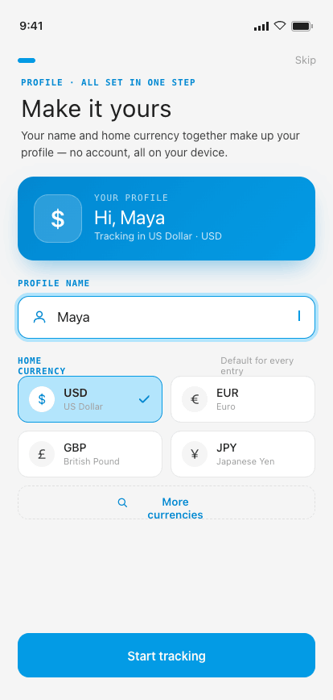
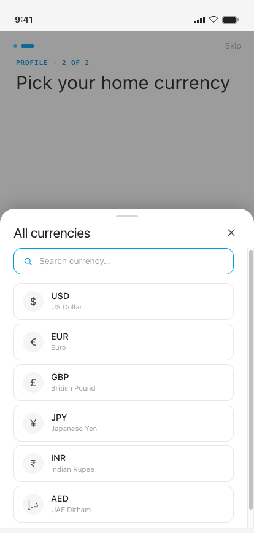

# 02·P · Profile Setup

**Flow:** First launch · between Onboarding & Home  
**Purpose:** Account-free personalization — name + home currency on **one merged screen**. No login; everything stays on-device.

> **Optimization (Jun 2026):** the former two-step wizard (P1 Name → P2 Home currency) is consolidated into a single screen. A live **identity card** fuses both inputs — the chosen currency symbol becomes the avatar emblem and the name becomes the greeting — so the user sees their profile assemble in real time. Cuts first-run from 2 steps to 1.

---

## States

### P1 · Profile + currency (merged)

### P1 · Currency picker

## Behavior & interactions

- **Identity card** (top) is a live preview: greeting updates from the name field, the emblem + “Tracking in … · CODE” line updates from the selected currency.
- **Name** personalizes the Home greeting (“Hi, Maya”) and CSV exports. Optional; the field is pre-focused and the primary action is always enabled.
- **Home currency** applies to every entry (single-currency MVP). Shown as a 2×2 quick grid of the four most common currencies (USD default, selected).
- **“More currencies”** opens the searchable picker bottom sheet; selecting a row applies and closes in one tap, updating the grid + identity card.
- **“Start tracking”** completes setup and lands on Home.

## Component composition · M3 mapping

| Component | Role | Compose / M3 |
|---|---|---|
| Stepper header | “PROFILE · ALL SET IN ONE STEP” | `Text · labelMedium (mono)` |
| Identity card | Live name + currency preview, gradient surface | `custom Surface` (clay→clayDeep gradient) |
| Text field | Name input with leading user icon | `OutlinedTextField / BasicTextField` |
| Selectable tile | Currency quick-pick, check on selected | `custom Surface(onClick)` · 2-col grid |
| Dashed action | “More currencies” → opens picker | `OutlinedButton` (dashed outline) |
| Bottom sheet + Search field | Full currency picker | `ModalBottomSheet` |

## Tokens applied

**Type**

- Screen title — Inter 28sp
- Identity greeting — Inter 22sp on clay
- Eyebrow — Geist Mono 11sp / 0.10–0.12em upper
- Field text — Manrope 14sp · tile text 14sp

**Color**

- identity card = `clayDeep #0288D1 → clay #039BE5` 135° gradient · `onPrimary` text/emblem at 16–82% white
- selected tile tint = blue100 #B3E5FC wash + clay border
- check = clay #039BE5

**Shape · spacing**

- Identity card radius 20dp · field & tile radius 13–14dp
- tile padding 11dp · grid gap 10dp
- sheet top corners 22dp

---

## Foundations (shared reference)

Applies to every screen. Full source: [`../tokens.md`](../tokens.md) · component specs in [`../components/`](../components/).

### Type — three families, one job each

| Role | Family | Size / Line | Tracking | Weight |
|---|---|---|---|---|
| Display amount | Instrument Serif | 64 / 64 | -0.025em | Regular |
| Card amount | Instrument Serif | 40 / 40 | -0.02em | Regular |
| Hero greeting | Instrument Serif | 30 / 32 | -0.015em | Regular |
| Sheet title | Instrument Serif | 22 / 24 | -0.01em | Regular |
| Section / day head | Instrument Serif | 18 / 20 | -0.01em | Regular |
| Screen header / app-bar | Instrument Serif | 17 / 20 | 0 | Regular |
| Body / emphasis / button | Manrope | 14 / 1.4 | 0 / -0.005em | 400–600 |
| Caption | Manrope | 11.5 / 1.4 | 0 | 400–500 |
| Eyebrow / label | Geist Mono | 11 / 1.3 | 0.10–0.12em (upper) | 500–600 |
| Timestamp / figures | Geist Mono | 11.5–12 | 0.04em | 400–500 |

> Amounts are **always Instrument Serif**. Compose: `PlatformTextStyle(includeFontPadding = false)` + `LineHeightStyle(Center, Both)` on every title/amount; Instrument Serif ships **Regular + Italic only — never request bold**. The `$` glyph is ≈0.47× the figure in `clay`; decimals (`.00`) sit in `ink3`.

### Color

**Primary — Material blue**

| Token | Hex | Role |
|---|---|---|
| `blue100` / clayTint | `#B3E5FC` | Tint behind icons, active wash |
| `blue300` / claySoft | `#4FC3F7` | Soft accent |
| `blue500` / **clay** | `#039BE5` | **Primary** — actions, active nav, FAB, links, amount accents |
| `blue700` / clayDeep | `#0288D1` | Pressed / deep primary |

**Signal hues**

| Token | Hex | Role |
|---|---|---|
| `green500` / sage | `#4CAF50` | Success, on-track, **I Lent** |
| `sageTint` | `#C8E6C9` | Success badge tint |
| `red400` / danger | `#EF5350` | Destructive, over-budget, **I Owe** |
| `dangerTint` | `#FFCDD2` | Danger badge tint |
| `tag` | `#FB8C00` | **Event @-tags** — the one warm signal |
| `tagTint` | `#FFE0B2` | Tag tile tint |

**Budget progress system**

| Range | State | Color |
|---|---|---|
| 0–100% | On track | soft blue `#B3D4E8` |
| 101–110% | Over budget | warm yellow `#F5E6A3` |
| 110%+ | Significantly over | soft red `#E07070` |

**Neutrals & semantic**

| Token | Hex | Role |
|---|---|---|
| `paper` | `#F5F5F5` | App background |
| `card` / white | `#FFFFFF` | Cards, sheets, nav, fields |
| `ink` | `#212121` | Primary text |
| `ink2` | `#424242` | Secondary text |
| `ink3` | `#757575` | Captions, labels |
| `muted` | `#9E9E9E` | Placeholders |
| `muted2` | `#BDBDBD` | Disabled glyph / empty amount |
| `lineStrong` | `#E0E0E0` | Outlined borders |
| `line` | `rgba(33,33,33,.10)` | Card & row borders |
| `line2` | `rgba(33,33,33,.06)` | Inner dividers |

### M3 ColorScheme & Typography mapping

- `primary` = blue500 `#039BE5` · **`onPrimary` = warm white `#FFFDF6`** (not pure white) · `surface` = white · `background` = paper · `onSurface` = ink · `onSurfaceVariant` = ink3 · `outline` = lineStrong · `outlineVariant` = line · `error` = danger · `tertiary` = tag.
- Success / highlight / budget-progress colors have **no M3 slot** — expose via a custom `ProColors` object.
- `displayLarge` → display amount · `headlineMedium` → screen title · `titleMedium` → section head · `bodyMedium` → body · `labelMedium` → eyebrow · `bodySmall` → caption.

### Shape · spacing · elevation · motion

- **Radius:** chip / pill / FAB = full · button sm/md/lg = 10 / 12 / 14 · numeric key = 12 · field / tile = 14 · card = 16–18 · sheet top = 22 · bottom-nav top = 8.
- **Spacing:** 8dp base rhythm (6 / 8 / 10 / 12 / 16 / 26) · card inner pad 18dp · row 12dp v / 8dp h · touch targets ≥ 44dp (FAB 64).
- **Elevation = drop-shadow only (no M3 tonal tint):** card `0 1 0 / 0 6 16 rgba(33,33,33,.03–.04)` · FAB `0 4 10 rgba(3,155,229,.25)` · nav `0 -6 24 rgba(0,0,0,.10)` · sheet `0 -8 24 rgba(0,0,0,.15)`.
- **Motion** (curve `cubic-bezier(.22,.61,.36,1)`): screen forward/back 280ms · sheet-up 340ms · toast 2400ms · new-row pulse 1800ms · validation shake ±4dp 280ms · tap scale 0.97 / 80ms.

### Conventions

- Single **light** theme. Surfaces pure white on warm-grey paper; **1 px = 1 dp**; tracking values in `em`.
- Wire as a custom `ProExpenseTheme` wrapping `MaterialTheme` with overridden `ColorScheme`, `Typography`, and custom `Dimens` / `Shapes`.
- `--sans` = **Manrope** · `--mono` = **Geist Mono** · `--serif` = **Instrument Serif** (display only — never body or controls).

---

_Pro Expense · Android screen spec · light theme · 1 px = 1 dp · captured at 414 × 868 dp from the shipped Hi-Fi build._
