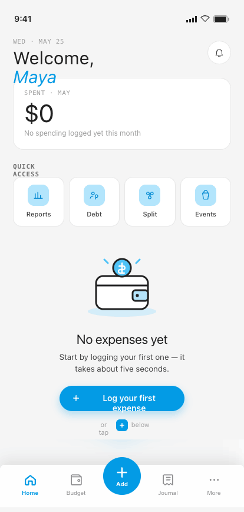
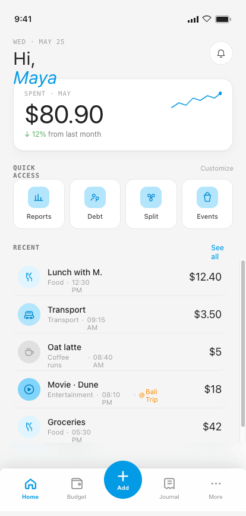
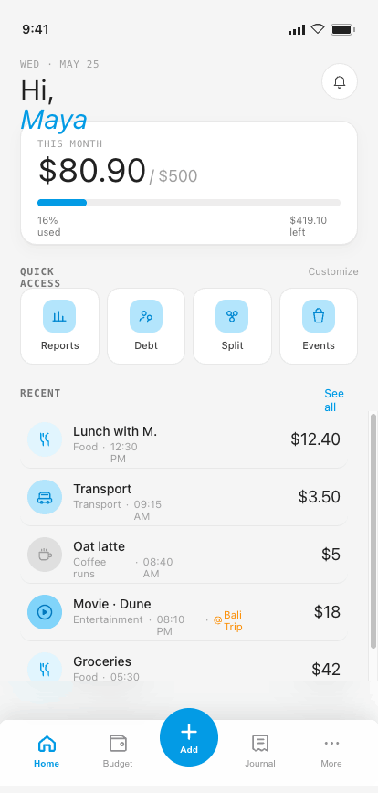
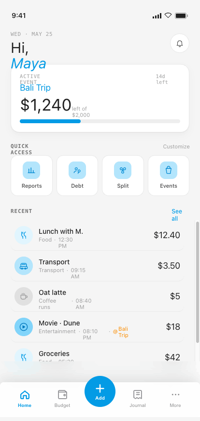

# 03 · Home

**Flow:** Central hub  
**Purpose:** Contextual financial snapshot + fast access to logging. Header adapts to persona.

---

## States

### Fresh user (empty)

### Casual spender

### Budget Planner

### Event Organizer

## Behavior & interactions

- Contextual header switches by persona: Casual → total spent this month; Budget Planner → spent vs. budget ($320 / $500 + progress); Event Organizer → active event name + remaining balance.
- With multiple overlapping active events, the header shows the most recently created one.
- Active Event card appears only when an event is running.
- Recent transactions: last 5–10 entries (badge, note, meta, amount). “See all” → Journal. Income entries render their amount in success green instead of ink (see `04-add-expense.md` / `components/category.md`).
- **Row kinds (new, previously undocumented):** a row can be Expense, Income, a Debt (Lent/Owed), or
  a Shared Cost split — see `components/transaction-row.md` for the shared badge/color/title rules.
  On Home Recents specifically: Debt Lent/Owed rows are always shown here (a debt is a real,
  counted transaction the moment its "record as transaction" toggle is on), but Split rows are
  currently **hidden** from Home Recents pending final mixed-kind UX sign-off — they still show in
  Journal (see `05-journal.md`). Home Recents is also the one place an **Owe** row's amount renders
  in success green instead of the neutral tone Journal uses, matching the persona snapshot's
  optimistic framing; the badge icon color (Lent=green / Owe=red) is unaffected and always follows
  Debt Tracker's own convention.
- Empty state (fresh user): illustrated, “No expenses yet…”, single CTA “Log your first expense”.
- Quick-access tiles deep-link to Reports / Debt / Split / **Goals** (renamed from “Events” — see `components/quick-access.md`). Split now opens directly on Shared Costs' amount-input screen rather than its History list (see `10-shared-costs.md`); Debt still opens its list. **Goals** always lands on the Budget tab's event list, clearing any event previously opened via the Active Event card or a Journal `@` tag — it never reopens a stale event Detail.
- Bottom nav (Home active) + raised center Add are always present on top-level screens.

## Component composition · M3 mapping

| Component | Role | Compose / M3 |
|---|---|---|
| Context header card | Persona-driven summary | `Card (elevation 0, white)` |
| Quick-access tile ×4 | Feature shortcuts | `custom Surface(onClick)` |
| Transaction row + day grouping | Recent list | `custom Row in LazyColumn` |
| Bottom navigation + Add FAB | Top-level nav | `NavigationBar + FAB` |
| Empty state | Fresh-user illustration + CTA | `Column + Image + Button` |

## Tokens applied

**Type**

- Greeting — Inter 30sp, emphasis word italic in clay
- Card amount — Inter 40sp / -0.02em
- Eyebrow — Geist Mono 11sp upper
- Row amount — Inter 18sp

**Color**

- primary clay #039BE5 (amount $, links, active nav, FAB)
- ink #212121 / ink3 #757575
- card #FFFFFF on paper #F5F5F5
- tile tint blue100 #B3E5FC

**Shape · spacing**

- Card radius 16–18dp, padding 18dp
- tile radius 14dp, icon box 36dp
- FAB 64dp raised -24dp
- row pad 12×8dp

---

## Foundations (shared reference)

Applies to every screen. Full source: [`../tokens.md`](../tokens.md) · component specs in [`../components/`](../components/).

### Type — three families, one job each

| Role | Family | Size / Line | Tracking | Weight |
|---|---|---|---|---|
| Display amount | Inter | 64 / 64 | -0.025em | Regular |
| Card amount | Inter | 40 / 40 | -0.02em | Regular |
| Hero greeting | Inter | 30 / 32 | -0.015em | Regular |
| Sheet title | Inter | 22 / 24 | -0.01em | Regular |
| Section / day head | Inter | 18 / 20 | -0.01em | Regular |
| Screen header / app-bar | Inter | 17 / 20 | 0 | Regular |
| Body / emphasis / button | Manrope | 14 / 1.4 | 0 / -0.005em | 400–600 |
| Caption | Manrope | 11.5 / 1.4 | 0 | 400–500 |
| Eyebrow / label | Geist Mono | 11 / 1.3 | 0.10–0.12em (upper) | 500–600 |
| Timestamp / figures | Geist Mono | 11.5–12 | 0.04em | 400–500 |

> Amounts are **always Inter**. Compose: `PlatformTextStyle(includeFontPadding = false)` + `LineHeightStyle(Center, Both)` on every title/amount; Inter amount styles use **Regular only** via bundled variable font. The `$` glyph is ≈0.47× the figure in `clay`; decimals (`.00`) sit in `ink3`.

### Color

**Primary — Material blue**

| Token | Hex | Role |
|---|---|---|
| `blue100` / clayTint | `#B3E5FC` | Tint behind icons, active wash |
| `blue300` / claySoft | `#4FC3F7` | Soft accent |
| `blue500` / **clay** | `#039BE5` | **Primary** — actions, active nav, FAB, links, amount accents |
| `blue700` / clayDeep | `#0288D1` | Pressed / deep primary |

**Signal hues**

| Token | Hex | Role |
|---|---|---|
| `green500` / sage | `#4CAF50` | Success, on-track, **I Lent** |
| `sageTint` | `#C8E6C9` | Success badge tint |
| `red400` / danger | `#EF5350` | Destructive, over-budget, **I Owe** |
| `dangerTint` | `#FFCDD2` | Danger badge tint |
| `tag` | `#FB8C00` | **Event @-tags** — the one warm signal |
| `tagTint` | `#FFE0B2` | Tag tile tint |

**Budget progress system**

| Range | State | Color |
|---|---|---|
| 0–100% | On track | soft blue `#B3D4E8` |
| 101–110% | Over budget | warm yellow `#F5E6A3` |
| 110%+ | Significantly over | soft red `#E07070` |

**Neutrals & semantic**

| Token | Hex | Role |
|---|---|---|
| `paper` | `#F5F5F5` | App background |
| `card` / white | `#FFFFFF` | Cards, sheets, nav, fields |
| `ink` | `#212121` | Primary text |
| `ink2` | `#424242` | Secondary text |
| `ink3` | `#757575` | Captions, labels |
| `muted` | `#9E9E9E` | Placeholders |
| `muted2` | `#BDBDBD` | Disabled glyph / empty amount |
| `lineStrong` | `#E0E0E0` | Outlined borders |
| `line` | `rgba(33,33,33,.10)` | Card & row borders |
| `line2` | `rgba(33,33,33,.06)` | Inner dividers |

### M3 ColorScheme & Typography mapping

- `primary` = blue500 `#039BE5` · **`onPrimary` = warm white `#FFFDF6`** (not pure white) · `surface` = white · `background` = paper · `onSurface` = ink · `onSurfaceVariant` = ink3 · `outline` = lineStrong · `outlineVariant` = line · `error` = danger · `tertiary` = tag.
- Success / highlight / budget-progress colors have **no M3 slot** — expose via a custom `ProColors` object.
- `displayLarge` → display amount · `headlineMedium` → screen title · `titleMedium` → section head · `bodyMedium` → body · `labelMedium` → eyebrow · `bodySmall` → caption.

### Shape · spacing · elevation · motion

- **Radius:** chip / pill / FAB = full · button sm/md/lg = 10 / 12 / 14 · numeric key = 12 · field / tile = 14 · card = 16–18 · sheet top = 22 · bottom-nav top = 8.
- **Spacing:** 8dp base rhythm (6 / 8 / 10 / 12 / 16 / 26) · card inner pad 18dp · row 12dp v / 8dp h · touch targets ≥ 44dp (FAB 64).
- **Elevation = drop-shadow only (no M3 tonal tint):** card `0 1 0 / 0 6 16 rgba(33,33,33,.03–.04)` · FAB `0 8 20 rgba(3,155,229,.28)` · nav `0 -6 24 rgba(0,0,0,.10)` · sheet `0 -8 24 rgba(0,0,0,.15)`.
- **Motion** (curve `cubic-bezier(.22,.61,.36,1)`): screen forward/back 280ms · sheet-up 340ms · toast 2400ms · new-row pulse 1800ms · validation shake ±4dp 280ms · tap scale 0.97 / 80ms.

### Conventions

- Single **light** theme. Surfaces pure white on warm-grey paper; **1 px = 1 dp**; tracking values in `em`.
- Wire as a custom `ProExpenseTheme` wrapping `MaterialTheme` with overridden `ColorScheme`, `Typography`, and custom `Dimens` / `Shapes`.
- `--sans` = **Manrope** · `--mono` = **Geist Mono** · `--display` = **Inter** (titles + amounts — never body or controls).

---

_Pro Expense · Android screen spec · light theme · 1 px = 1 dp · captured at 414 × 868 dp from the shipped Hi-Fi build._
