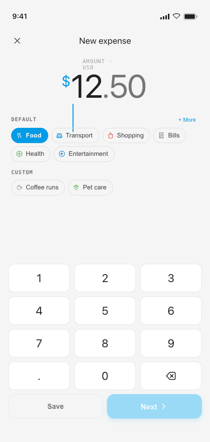
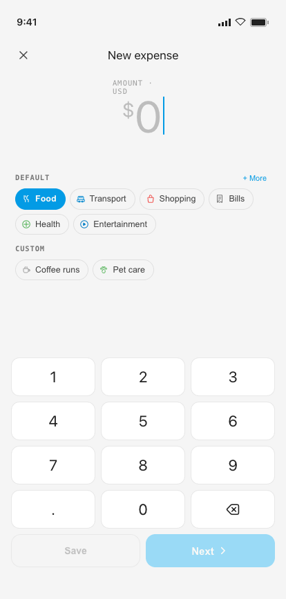
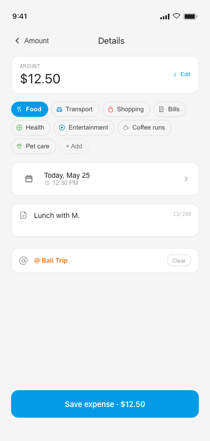
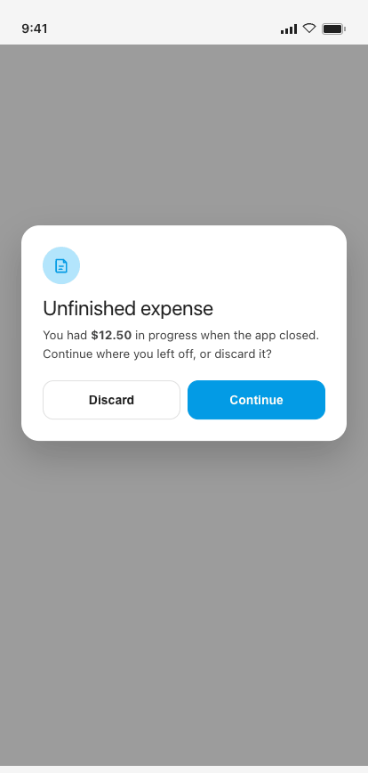
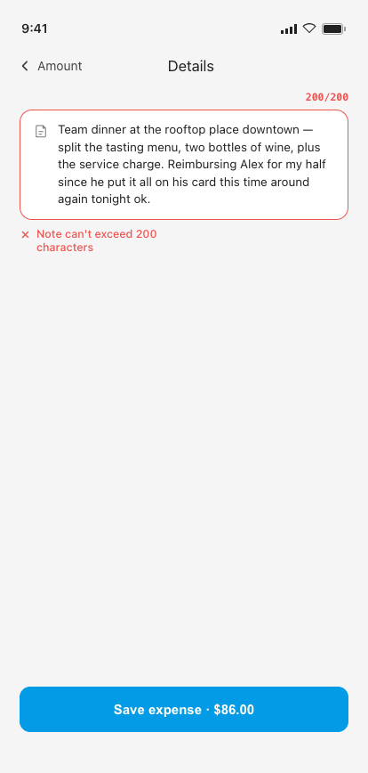
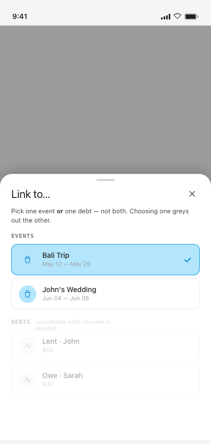

# 04 · Add Expense

**Flow:** Quick Log · core  
**Purpose:** Log an expense in under 5 seconds. Two sub-screens: Amount, then Details.

---

## States

### Amount · typed

### Amount · $0 validation

### Details · with @ tag

## Behavior & interactions

- Sub-screen 1 (Amount): keypad auto-opens; amount is large + centered. Category chips scroll horizontally, “Food” pre-selected.
- Input rules: whole part ≤ 7 digits, fraction ≤ 2; single decimal; leading zeros stripped (except “0.”); commas grouped live.
- canProceed = value > 0. Save (quick-commit) and Next are disabled until amount > $0.
- Tapping a disabled action shakes the field (±4dp) and shows “Amount must be greater than $0”.
- Save → quick-commits with default category, slides back to Home, fires success toast.
- Next → Details. Details amount is read-only at top, tap to return and edit (value persists).
- Sub-screen 2 (Details): category required; date defaults to today (future allowed); note optional ≤ 200 chars; @ tag optional.
- @ tag field is hidden when there are no active events or debts; otherwise optional. One link only (Event OR Debt).
- Back from Amount with no value: silent navigation, no save, no prompt.

## Component composition · M3 mapping

| Component | Role | Compose / M3 |
|---|---|---|
| Amount entry (keypad + validation) | Numeric input, Inter keys, Save/Next | `custom (no M3 keypad)` |
| Category chip group | Single-select, horizontal scroll | `FilterChip (shape = CircleShape)` |
| Bottom sheet — Date & time | Date picker, future notice | `ModalBottomSheet` |
| Bottom sheet — Tag picker | Events/Debts, mutually exclusive | `ModalBottomSheet` |
| Toast | “Expense saved” confirmation | `Snackbar` |
| Button (primary, lg) | Save on Details | `Button` |

## Tokens applied

**Type**

- Display amount — Inter 64sp / -0.025em
- Keypad keys — Inter 22sp
- $ glyph ≈0.47× figure in clay
- decimal .00 in ink3
- Read-only amount (Details) — Inter 26sp

**Color**

- empty figure = muted2 #BDBDBD, $ stays clay
- helper / shake text = clay (error affordance)
- tag = #FB8C00

**Shape · spacing**

- Keypad 3-col grid, gap 8dp, key radius 12dp
- Save/Next radius 14dp
- FAB shadow 0 8 20 rgba(3,155,229,.28)

## Edge cases & error states

### Draft restore

App force-closed mid-entry → draft auto-saved. On relaunch, before PIN: Continue / Discard (no auth required).

### Note at 200 cap

Note hard-capped at 200 chars; counter turns to error color at the limit; further input ignored.

### @ tag mutual exclusion

Picking an Event greys out & disables the Debts group (and vice-versa). Clear resets both.

---

## Foundations (shared reference)

Applies to every screen. Full source: [`../tokens.md`](../tokens.md) · component specs in [`../components/`](../components/).

### Type — three families, one job each

| Role | Family | Size / Line | Tracking | Weight |
|---|---|---|---|---|
| Display amount | Inter | 64 / 64 | -0.025em | Regular |
| Card amount | Inter | 40 / 40 | -0.02em | Regular |
| Hero greeting | Inter | 30 / 32 | -0.015em | Regular |
| Sheet title | Inter | 22 / 24 | -0.01em | Regular |
| Section / day head | Inter | 18 / 20 | -0.01em | Regular |
| Screen header / app-bar | Inter | 17 / 20 | 0 | Regular |
| Body / emphasis / button | Manrope | 14 / 1.4 | 0 / -0.005em | 400–600 |
| Caption | Manrope | 11.5 / 1.4 | 0 | 400–500 |
| Eyebrow / label | Geist Mono | 11 / 1.3 | 0.10–0.12em (upper) | 500–600 |
| Timestamp / figures | Geist Mono | 11.5–12 | 0.04em | 400–500 |

> Amounts are **always Inter**. Compose: `PlatformTextStyle(includeFontPadding = false)` + `LineHeightStyle(Center, Both)` on every title/amount; Inter amount styles use **Regular only** via bundled variable font. The `$` glyph is ≈0.47× the figure in `clay`; decimals (`.00`) sit in `ink3`.

### Color

**Primary — Material blue**

| Token | Hex | Role |
|---|---|---|
| `blue100` / clayTint | `#B3E5FC` | Tint behind icons, active wash |
| `blue300` / claySoft | `#4FC3F7` | Soft accent |
| `blue500` / **clay** | `#039BE5` | **Primary** — actions, active nav, FAB, links, amount accents |
| `blue700` / clayDeep | `#0288D1` | Pressed / deep primary |

**Signal hues**

| Token | Hex | Role |
|---|---|---|
| `green500` / sage | `#4CAF50` | Success, on-track, **I Lent** |
| `sageTint` | `#C8E6C9` | Success badge tint |
| `red400` / danger | `#EF5350` | Destructive, over-budget, **I Owe** |
| `dangerTint` | `#FFCDD2` | Danger badge tint |
| `tag` | `#FB8C00` | **Event @-tags** — the one warm signal |
| `tagTint` | `#FFE0B2` | Tag tile tint |

**Budget progress system**

| Range | State | Color |
|---|---|---|
| 0–100% | On track | soft blue `#B3D4E8` |
| 101–110% | Over budget | warm yellow `#F5E6A3` |
| 110%+ | Significantly over | soft red `#E07070` |

**Neutrals & semantic**

| Token | Hex | Role |
|---|---|---|
| `paper` | `#F5F5F5` | App background |
| `card` / white | `#FFFFFF` | Cards, sheets, nav, fields |
| `ink` | `#212121` | Primary text |
| `ink2` | `#424242` | Secondary text |
| `ink3` | `#757575` | Captions, labels |
| `muted` | `#9E9E9E` | Placeholders |
| `muted2` | `#BDBDBD` | Disabled glyph / empty amount |
| `lineStrong` | `#E0E0E0` | Outlined borders |
| `line` | `rgba(33,33,33,.10)` | Card & row borders |
| `line2` | `rgba(33,33,33,.06)` | Inner dividers |

### M3 ColorScheme & Typography mapping

- `primary` = blue500 `#039BE5` · **`onPrimary` = warm white `#FFFDF6`** (not pure white) · `surface` = white · `background` = paper · `onSurface` = ink · `onSurfaceVariant` = ink3 · `outline` = lineStrong · `outlineVariant` = line · `error` = danger · `tertiary` = tag.
- Success / highlight / budget-progress colors have **no M3 slot** — expose via a custom `ProColors` object.
- `displayLarge` → display amount · `headlineMedium` → screen title · `titleMedium` → section head · `bodyMedium` → body · `labelMedium` → eyebrow · `bodySmall` → caption.

### Shape · spacing · elevation · motion

- **Radius:** chip / pill / FAB = full · button sm/md/lg = 10 / 12 / 14 · numeric key = 12 · field / tile = 14 · card = 16–18 · sheet top = 22 · bottom-nav top = 8.
- **Spacing:** 8dp base rhythm (6 / 8 / 10 / 12 / 16 / 26) · card inner pad 18dp · row 12dp v / 8dp h · touch targets ≥ 44dp (FAB 64).
- **Elevation = drop-shadow only (no M3 tonal tint):** card `0 1 0 / 0 6 16 rgba(33,33,33,.03–.04)` · FAB `0 8 20 rgba(3,155,229,.28)` · nav `0 -6 24 rgba(0,0,0,.10)` · sheet `0 -8 24 rgba(0,0,0,.15)`.
- **Motion** (curve `cubic-bezier(.22,.61,.36,1)`): screen forward/back 280ms · sheet-up 340ms · toast 2400ms · new-row pulse 1800ms · validation shake ±4dp 280ms · tap scale 0.97 / 80ms.

### Conventions

- Single **light** theme. Surfaces pure white on warm-grey paper; **1 px = 1 dp**; tracking values in `em`.
- Wire as a custom `ProExpenseTheme` wrapping `MaterialTheme` with overridden `ColorScheme`, `Typography`, and custom `Dimens` / `Shapes`.
- `--sans` = **Manrope** · `--mono` = **Geist Mono** · `--display` = **Inter** (titles + amounts — never body or controls).

---

_Pro Expense · Android screen spec · light theme · 1 px = 1 dp · captured at 414 × 868 dp from the shipped Hi-Fi build._
