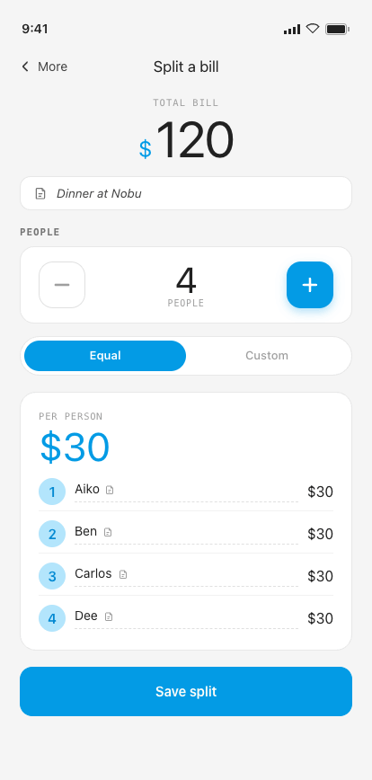
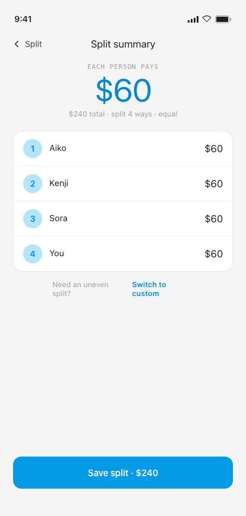
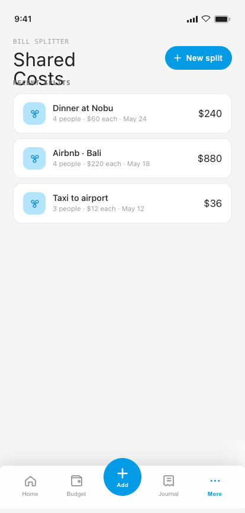
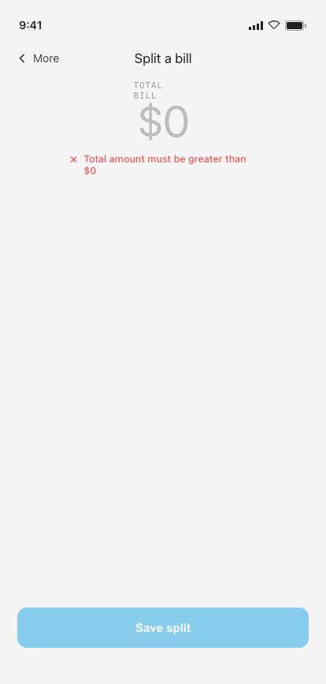
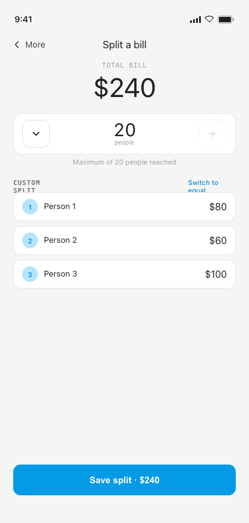

# 10 · Shared Costs

**Flow:** Bill splitting  
**Purpose:** Instant bill splitter — total + people + optional names → per-person share. No group setup.

---

## States

### Input · equal

### Split summary

### History

### Edit person (sheet)

_No PNG yet — added with the Flow 08 v2 handoff (`design_handoff_shared_costs/`, JSX-only reference,
`EditPersonSheetV4`). Screen fidelity for this state is verified against the JSX/README description,
not a pixel-matched capture — flagged as the one state without a screenshot gate._

Bottom sheet reached from either edit-icon button on Input (the per-person-card header button, or
each row's own button). Shows a compact roster of every person (avatar/name/amount, active person
highlighted, others checked), a combined name + amount row for the active person, and a
Done/Next footer.

## Behavior & interactions

- Enter total (large, prefixed with the home currency symbol, decimal keypad), people count via stepper (min 2, max 20).
- Per-person rows are **read-only** (avatar, name, amount) with a small edit-icon button — tapping
  it (row or the per-person-card header) opens the **Edit person** sheet scoped to that participant.
  Renaming and (in Custom mode) share editing happen there, not inline.
- In the Edit person sheet: the name field is a real text input (system IME); the amount field is
  editable only in Custom mode, driven by an on-screen keypad (matching the Add Expense pattern)
  rather than the system IME. The first keystroke after opening the amount field overwrites the
  pre-filled value outright rather than appending onto it. Equal-mode amounts show locked with a
  lock icon (computed, not entered). Roster rows are tap targets to jump between people without
  closing the sheet. "Done" closes the sheet without navigating; "Next" advances to the next person,
  or to Split summary after the last one.
- Split mode Equal (default) or Custom — per-person shares update live. Custom shares are **never
  auto-rebalanced**: they need not sum to the total, and editing one share never adjusts the others.
  The total remains the stored source of truth. The per-person-card header shows "Matches total" or
  "vs $X total" in Custom mode as a live hint.
- Split summary sub-screen shows per-person amounts; Back persists all values.
- Save stores the TOTAL as a linked expense record — saved splits **do appear in Journal and Reports** (one `FinanceRecord` per split, upserted alongside the split itself).
- History: tap to view full split; swipe-left to delete (confirm) — deleting a split also removes its linked Journal record atomically. Editing a split updates its linked record in place.

## Component composition · M3 mapping

| Component | Role | Compose / M3 |
|---|---|---|
| Total amount input | Large prominent figure | `custom + Inter Text` |
| People stepper | −/+ count, min 2 / max 20 | `custom Row + IconButtons` |
| Split-mode toggle | Equal / Custom | `SegmentedButton` |
| Per-person rows | Read-only share list + edit-icon button | `custom Row` |
| Edit person sheet | Name + amount editor for one participant | `ProBottomSheetHost` |
| People roster (in sheet) | Jump between participants | `custom Column` |
| History list | Past splits | `LazyColumn + SwipeToDismiss` |
| Button (primary) | Save split | `Button` |

## Tokens applied

**Type**

- Total / per-person — Inter 40–64sp
- Eyebrow — Geist Mono 11sp upper
- names — Manrope 14sp

**Color**

- per-person figure = clay #039BE5
- stepper disabled glyph = muted2 #BDBDBD

**Shape · spacing**

- stepper hit target ≥ 44dp
- row pad 12dp

## Edge cases & error states

### $0 total

Total $0 → Save disabled + “Total amount must be greater than $0.”

### Max 20 + custom

At count = 20 the + button is disabled & greyed (no error). At min 2 the − button is disabled. Custom split lets each share be edited (incl. $0).

---

## Foundations (shared reference)

Applies to every screen. Full source: [`../tokens.md`](../tokens.md) · component specs in [`../components/`](../components/).

### Type — three families, one job each

| Role | Family | Size / Line | Tracking | Weight |
|---|---|---|---|---|
| Display amount | Inter | 64 / 64 | -0.025em | Regular |
| Card amount | Inter | 40 / 40 | -0.02em | Regular |
| Hero greeting | Inter | 30 / 32 | -0.015em | Regular |
| Sheet title | Inter | 22 / 24 | -0.01em | Regular |
| Section / day head | Inter | 18 / 20 | -0.01em | Regular |
| Screen header / app-bar | Inter | 17 / 20 | 0 | Regular |
| Body / emphasis / button | Manrope | 14 / 1.4 | 0 / -0.005em | 400–600 |
| Caption | Manrope | 11.5 / 1.4 | 0 | 400–500 |
| Eyebrow / label | Geist Mono | 11 / 1.3 | 0.10–0.12em (upper) | 500–600 |
| Timestamp / figures | Geist Mono | 11.5–12 | 0.04em | 400–500 |

> Amounts are **always Inter**. Compose: `PlatformTextStyle(includeFontPadding = false)` + `LineHeightStyle(Center, Both)` on every title/amount; Inter amount styles use **Regular only** via bundled variable font. The `$` glyph is ≈0.47× the figure in `clay`; decimals (`.00`) sit in `ink3`.

### Color

**Primary — Material blue**

| Token | Hex | Role |
|---|---|---|
| `blue100` / clayTint | `#B3E5FC` | Tint behind icons, active wash |
| `blue300` / claySoft | `#4FC3F7` | Soft accent |
| `blue500` / **clay** | `#039BE5` | **Primary** — actions, active nav, FAB, links, amount accents |
| `blue700` / clayDeep | `#0288D1` | Pressed / deep primary |

**Signal hues**

| Token | Hex | Role |
|---|---|---|
| `green500` / sage | `#4CAF50` | Success, on-track, **I Lent** |
| `sageTint` | `#C8E6C9` | Success badge tint |
| `red400` / danger | `#EF5350` | Destructive, over-budget, **I Owe** |
| `dangerTint` | `#FFCDD2` | Danger badge tint |
| `tag` | `#FB8C00` | **Event @-tags** — the one warm signal |
| `tagTint` | `#FFE0B2` | Tag tile tint |

**Budget progress system**

| Range | State | Color |
|---|---|---|
| 0–100% | On track | soft blue `#B3D4E8` |
| 101–110% | Over budget | warm yellow `#F5E6A3` |
| 110%+ | Significantly over | soft red `#E07070` |

**Neutrals & semantic**

| Token | Hex | Role |
|---|---|---|
| `paper` | `#F5F5F5` | App background |
| `card` / white | `#FFFFFF` | Cards, sheets, nav, fields |
| `ink` | `#212121` | Primary text |
| `ink2` | `#424242` | Secondary text |
| `ink3` | `#757575` | Captions, labels |
| `muted` | `#9E9E9E` | Placeholders |
| `muted2` | `#BDBDBD` | Disabled glyph / empty amount |
| `lineStrong` | `#E0E0E0` | Outlined borders |
| `line` | `rgba(33,33,33,.10)` | Card & row borders |
| `line2` | `rgba(33,33,33,.06)` | Inner dividers |

### M3 ColorScheme & Typography mapping

- `primary` = blue500 `#039BE5` · **`onPrimary` = warm white `#FFFDF6`** (not pure white) · `surface` = white · `background` = paper · `onSurface` = ink · `onSurfaceVariant` = ink3 · `outline` = lineStrong · `outlineVariant` = line · `error` = danger · `tertiary` = tag.
- Success / highlight / budget-progress colors have **no M3 slot** — expose via a custom `ProColors` object.
- `displayLarge` → display amount · `headlineMedium` → screen title · `titleMedium` → section head · `bodyMedium` → body · `labelMedium` → eyebrow · `bodySmall` → caption.

### Shape · spacing · elevation · motion

- **Radius:** chip / pill / FAB = full · button sm/md/lg = 10 / 12 / 14 · numeric key = 12 · field / tile = 14 · card = 16–18 · sheet top = 22 · bottom-nav top = 8.
- **Spacing:** 8dp base rhythm (6 / 8 / 10 / 12 / 16 / 26) · card inner pad 18dp · row 12dp v / 8dp h · touch targets ≥ 44dp (FAB 64).
- **Elevation = drop-shadow only (no M3 tonal tint):** card `0 1 0 / 0 6 16 rgba(33,33,33,.03–.04)` · FAB `0 8 20 rgba(3,155,229,.28)` · nav `0 -6 24 rgba(0,0,0,.10)` · sheet `0 -8 24 rgba(0,0,0,.15)`.
- **Motion** (curve `cubic-bezier(.22,.61,.36,1)`): screen forward/back 280ms · sheet-up 340ms · toast 2400ms · new-row pulse 1800ms · validation shake ±4dp 280ms · tap scale 0.97 / 80ms.

### Conventions

- Single **light** theme. Surfaces pure white on warm-grey paper; **1 px = 1 dp**; tracking values in `em`.
- Wire as a custom `ProExpenseTheme` wrapping `MaterialTheme` with overridden `ColorScheme`, `Typography`, and custom `Dimens` / `Shapes`.
- `--sans` = **Manrope** · `--mono` = **Geist Mono** · `--display` = **Inter** (titles + amounts — never body or controls).

---

_Pro Expense · Android screen spec · light theme · 1 px = 1 dp · captured at 414 × 868 dp from the shipped Hi-Fi build._
