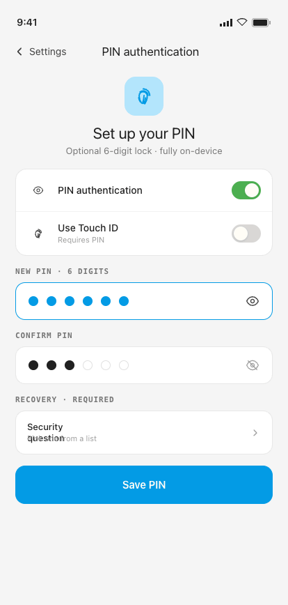
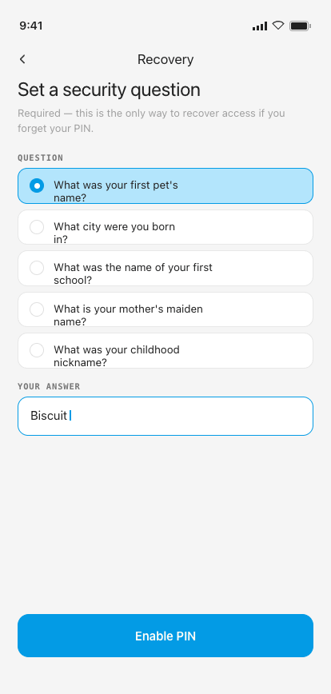
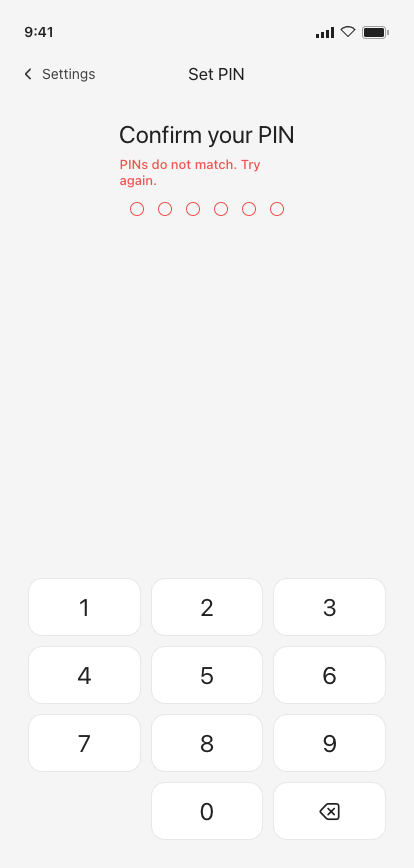
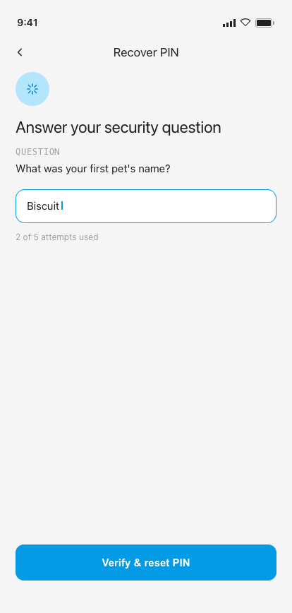

# 14 · PIN Setup

**Flow:** Security  
**Purpose:** Enable & configure an optional 6-digit PIN. Disabled by default; security question is mandatory.

---

## States

### Enable PIN

### Security question (required)

## Behavior & interactions

- Toggle to enable → enter 6-digit PIN → confirm (must match). Mismatch → “PINs do not match”, confirm field clears, original PIN kept.
- Biometric (Face ID / fingerprint) is offered but requires the PIN to be set first.
- Security question is REQUIRED — pick from a predefined list + answer; cannot enable PIN without it.
- Success: “PIN is now active. You’ll be asked to enter it on your next launch.”
- Change PIN: a dedicated 3-step overlay (Verify current → Enter new → Confirm new). Step 1 reuses the same re-verification screen as Disable PIN (heading “Confirm your current PIN”); mismatch on the confirm step clears the buffer and shows an inline error without leaving the step; Back from Confirm returns to Enter-new (not a full cancel).
- Disable PIN: tapping Disable in the manage sheet first shows a plain confirm dialog, then gates the actual disable behind the same re-verification overlay (heading “Confirm your PIN”, helper “Enter your current PIN to turn off protection”) — intent alone never disables it. Cancel from the overlay dismisses back to More with no partial state. Disabling also turns biometric off.
- Both re-verification overlays **reuse the main unlock screen's lockout state** (same attempt counter / countdown) so they can't be used to brute-force around the lock screen, and both swallow taps on the surface beneath them (rendered as an overlay sibling, not a real destination).
- Recovery options: security question (verify identity) or reset app (clear all data) as last resort.

## Component composition · M3 mapping

| Component | Role | Compose / M3 |
|---|---|---|
| Switch rows | PIN / biometric enable | `Switch` |
| PIN dots + keypad | 6-digit entry / confirm | `custom Row + keypad` |
| Security-question list | Single-select question | `RadioButton list` |
| Answer field | Recovery answer | `OutlinedTextField` |
| Button (primary) | Save / Enable PIN | `Button` |

## Tokens applied

**Type**

- Title — Inter 22–24sp (white-space: nowrap)
- helper — Manrope 13sp ink3
- error — Manrope 13sp danger

**Color**

- filled dots = clay; empty = outline
- error copy = danger #EF5350
- PIN icon tint = clay

**Shape · spacing**

- PIN dot 14dp, gap 14dp
- keypad keys radius 12dp

## Edge cases & error states

### PIN mismatch

On confirm mismatch: dots clear, shake (±4dp), “PINs do not match. Try again.” original PIN preserved.

### Recovery

Forgot PIN → security question → correct answer sets a new PIN. Wrong answer “Try again”; 5 wrong → 30s lockout, then attempts reset.

---

## Foundations (shared reference)

Applies to every screen. Full source: [`../tokens.md`](../tokens.md) · component specs in [`../components/`](../components/).

### Type — three families, one job each

| Role | Family | Size / Line | Tracking | Weight |
|---|---|---|---|---|
| Display amount | Inter | 64 / 64 | -0.025em | Regular |
| Card amount | Inter | 40 / 40 | -0.02em | Regular |
| Hero greeting | Inter | 30 / 32 | -0.015em | Regular |
| Sheet title | Inter | 22 / 24 | -0.01em | Regular |
| Section / day head | Inter | 18 / 20 | -0.01em | Regular |
| Screen header / app-bar | Inter | 17 / 20 | 0 | Regular |
| Body / emphasis / button | Manrope | 14 / 1.4 | 0 / -0.005em | 400–600 |
| Caption | Manrope | 11.5 / 1.4 | 0 | 400–500 |
| Eyebrow / label | Geist Mono | 11 / 1.3 | 0.10–0.12em (upper) | 500–600 |
| Timestamp / figures | Geist Mono | 11.5–12 | 0.04em | 400–500 |

> Amounts are **always Inter**. Compose: `PlatformTextStyle(includeFontPadding = false)` + `LineHeightStyle(Center, Both)` on every title/amount; Inter amount styles use **Regular only** via bundled variable font. The `$` glyph is ≈0.47× the figure in `clay`; decimals (`.00`) sit in `ink3`.

### Color

**Primary — Material blue**

| Token | Hex | Role |
|---|---|---|
| `blue100` / clayTint | `#B3E5FC` | Tint behind icons, active wash |
| `blue300` / claySoft | `#4FC3F7` | Soft accent |
| `blue500` / **clay** | `#039BE5` | **Primary** — actions, active nav, FAB, links, amount accents |
| `blue700` / clayDeep | `#0288D1` | Pressed / deep primary |

**Signal hues**

| Token | Hex | Role |
|---|---|---|
| `green500` / sage | `#4CAF50` | Success, on-track, **I Lent** |
| `sageTint` | `#C8E6C9` | Success badge tint |
| `red400` / danger | `#EF5350` | Destructive, over-budget, **I Owe** |
| `dangerTint` | `#FFCDD2` | Danger badge tint |
| `tag` | `#FB8C00` | **Event @-tags** — the one warm signal |
| `tagTint` | `#FFE0B2` | Tag tile tint |

**Budget progress system**

| Range | State | Color |
|---|---|---|
| 0–100% | On track | soft blue `#B3D4E8` |
| 101–110% | Over budget | warm yellow `#F5E6A3` |
| 110%+ | Significantly over | soft red `#E07070` |

**Neutrals & semantic**

| Token | Hex | Role |
|---|---|---|
| `paper` | `#F5F5F5` | App background |
| `card` / white | `#FFFFFF` | Cards, sheets, nav, fields |
| `ink` | `#212121` | Primary text |
| `ink2` | `#424242` | Secondary text |
| `ink3` | `#757575` | Captions, labels |
| `muted` | `#9E9E9E` | Placeholders |
| `muted2` | `#BDBDBD` | Disabled glyph / empty amount |
| `lineStrong` | `#E0E0E0` | Outlined borders |
| `line` | `rgba(33,33,33,.10)` | Card & row borders |
| `line2` | `rgba(33,33,33,.06)` | Inner dividers |

### M3 ColorScheme & Typography mapping

- `primary` = blue500 `#039BE5` · **`onPrimary` = warm white `#FFFDF6`** (not pure white) · `surface` = white · `background` = paper · `onSurface` = ink · `onSurfaceVariant` = ink3 · `outline` = lineStrong · `outlineVariant` = line · `error` = danger · `tertiary` = tag.
- Success / highlight / budget-progress colors have **no M3 slot** — expose via a custom `ProColors` object.
- `displayLarge` → display amount · `headlineMedium` → screen title · `titleMedium` → section head · `bodyMedium` → body · `labelMedium` → eyebrow · `bodySmall` → caption.

### Shape · spacing · elevation · motion

- **Radius:** chip / pill / FAB = full · button sm/md/lg = 10 / 12 / 14 · numeric key = 12 · field / tile = 14 · card = 16–18 · sheet top = 22 · bottom-nav top = 8.
- **Spacing:** 8dp base rhythm (6 / 8 / 10 / 12 / 16 / 26) · card inner pad 18dp · row 12dp v / 8dp h · touch targets ≥ 44dp (FAB 64).
- **Elevation = drop-shadow only (no M3 tonal tint):** card `0 1 0 / 0 6 16 rgba(33,33,33,.03–.04)` · FAB `0 8 20 rgba(3,155,229,.28)` · nav `0 -6 24 rgba(0,0,0,.10)` · sheet `0 -8 24 rgba(0,0,0,.15)`.
- **Motion** (curve `cubic-bezier(.22,.61,.36,1)`): screen forward/back 280ms · sheet-up 340ms · toast 2400ms · new-row pulse 1800ms · validation shake ±4dp 280ms · tap scale 0.97 / 80ms.

### Conventions

- Single **light** theme. Surfaces pure white on warm-grey paper; **1 px = 1 dp**; tracking values in `em`.
- Wire as a custom `ProExpenseTheme` wrapping `MaterialTheme` with overridden `ColorScheme`, `Typography`, and custom `Dimens` / `Shapes`.
- `--sans` = **Manrope** · `--mono` = **Geist Mono** · `--display` = **Inter** (titles + amounts — never body or controls).

---

_Pro Expense · Android screen spec · light theme · 1 px = 1 dp · captured at 414 × 868 dp from the shipped Hi-Fi build._
