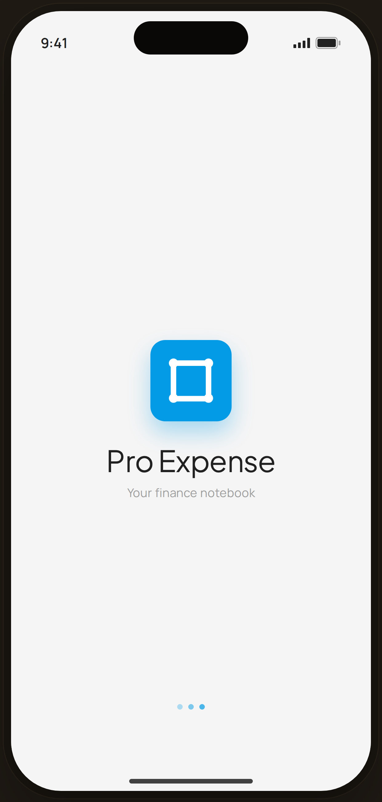

# Splash — Flow 04 · First Launch

`01-splash` · onboarding · artboard 414×868

## Purpose
The app launch screen shown while Pro Expense boots. It establishes brand (logo, name, tagline) before the onboarding carousel appears.

## Layout (top → bottom)
- Standard phone chrome: status bar (9:41, signal, battery), dynamic island, home indicator.
- Content is a single vertically- and horizontally-centered stack on the warm-paper canvas:
  - **App icon** — 88×88 rounded-square (radius 16) in primary blue with a white outlined-frame glyph, lifted by a soft blue glow shadow.
  - **Wordmark** "Pro Expense" — serif, 22px gap below the icon.
  - **Tagline** "Your finance notebook" — sans muted, 6px below the wordmark.
- **Loading dots** — three 6px dots, absolutely positioned 80px from the bottom, horizontal row with 6px gaps; opacity ramps 0.3 / 0.5 / 0.7 left→right.

## Components & content
- Visible copy: `Pro Expense`, `Your finance notebook`.
- App-icon glyph: a white outlined square/frame mark (the `ic_pro_expense` path) on a blue tile.
- Three blue loading dots (static; no nav, no buttons).
- No design-system Button or nav bar on this screen.

## Typography & color
- Wordmark "Pro Expense": `--serif`, 32px, letter-spacing -0.015em, `--ink` #212121.
- Tagline: `--sans`, 13px, `--muted` #9e9e9e.
- Icon tile: `--blue-500` #039be5, glyph fill `--white`, shadow `0 12px 24px rgba(3,155,229,0.32)`.
- Loading dots: `--blue-500` #039be5 at graduated opacity.
- Canvas: `--paper` #f5f5f5.

## States & interactions
- Static brand/loading state — no interactive tap targets. Auto-advances to onboarding (transition handled outside the component).

## Implementation notes
- Fully static; no props, no mock data. Reuses `PhoneShell` chrome. The app-icon SVG is inline (not from the Icon set). Loading dots are decorative (no animation defined in the component itself).
