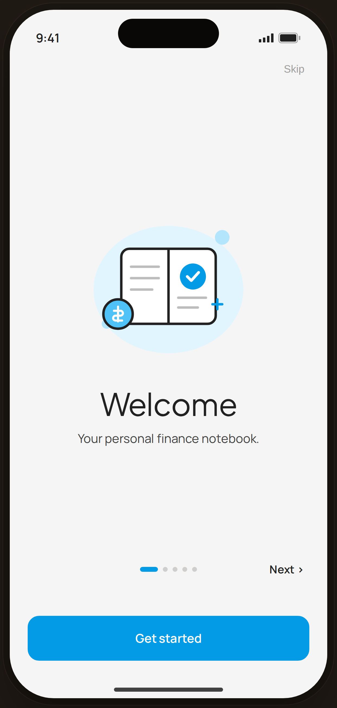

# Onboarding · Welcome — Flow 04 · First Launch

`02-onb-1` · onboarding · artboard 414×868

## Purpose
First slide of the 5-slide onboarding carousel (`<ScreenOnboardingHi slide={1} />`). Introduces Pro Expense as a personal finance notebook.

## Layout (top → bottom)
- Phone chrome (status bar, island, home indicator).
- **Top bar** — padding 14×22; right-aligned "Skip" text button (shown on all slides except the last).
- **Hero block** (flex-1, centered, 28px side padding):
  - 280px-wide illustration container (`IlloWelcome`).
  - **Title** "Welcome" — serif 38px, 28px above margin.
  - **Body** "Your personal finance notebook." — 12px below title, max-width 280px.
- **Nav row** (padding 0×28, 48px bottom margin): three columns — left "‹ Back" (transparent/hidden on slide 1), center 5 page dots, right "Next ›".
- **CTA** — bottom-anchored primary "Get started" button, full-width, padding 0×22, 38px bottom.

## Components & content
- Copy: `Skip`, `Welcome`, `Your personal finance notebook.`, `‹ Back` (invisible here), `Next ›`, `Get started`.
- DS components: `Button` variant `primary`, size `lg`, fullWidth.
- Page dots: 5 pills; active (dot 1) is a 22px-wide blue bar, inactive are 6px dots.
- Illustration `IlloWelcome`: open white notebook with spine, gray text lines, a blue circle with a white check, a blue coin with a hryvnia-style currency glyph, and a small blue sparkle, on a soft blue-50 blob.

## Typography & color
- Title: `--serif`, 38px, letter-spacing -0.02em, line-height 1.05, `--ink` #212121.
- Body: `--sans`, 15px, line-height 1.45, `--ink-2` #424242.
- Skip / Back / Next: `--sans` ~13px; Skip & Back `--muted` #9e9e9e, Next `--ink` 600.
- Active dot & button: `--clay` #039be5; inactive dots `rgba(43,31,23,0.18)`.
- Illustration palette: blue #039be5, blue-300 #4fc3f7, blue-100 #b3e5fc, blue-50 #e1f5fe, line #212121.

## States & interactions
- Slide 1 of 5: "‹ Back" is rendered transparent (no back target); "Skip" and "Next ›" both active. "Get started" is present on every slide as an early-exit CTA. Dots reflect position (dot 1 expanded), 0.2s width transition.

## Implementation notes
- Driven by `slide` prop (1); copy & illustration pulled from in-component `slides[]` array and `ONBOARD_ILLOS` map. Static prototype — paging/Skip/CTA are visual only. Reuses `PhoneShell`, `Button`.
