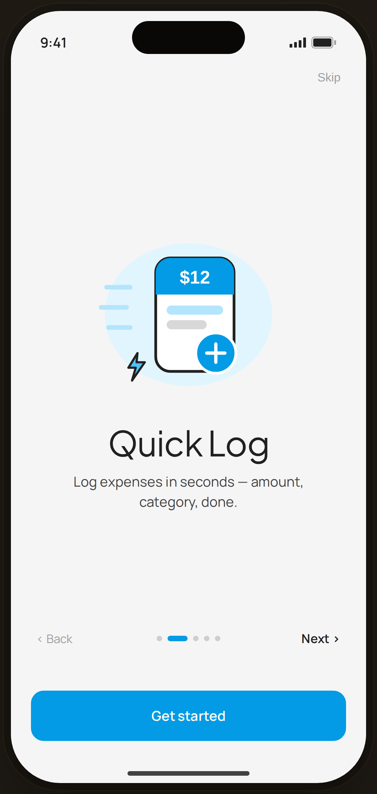

# Onboarding · Quick Log — Flow 04 · First Launch

`03-onb-2` · onboarding · artboard 414×868

## Purpose
Second slide of the 5-slide onboarding carousel (`<ScreenOnboardingHi slide={2} />`). Sells the core promise: logging an expense in seconds.

## Layout (top → bottom)
- Phone chrome (status bar, island, home indicator).
- **Top bar** — padding 14×22; right-aligned "Skip" text button.
- **Hero block** (flex-1, centered, 28px side padding): 280px illustration `IlloQuickLog`, then title "Quick Log" (serif 38px, 28px above), body 12px below (max-width 280px).
- **Nav row** (0×28, 48px bottom margin): left "‹ Back" (now visible/active), center 5 page dots (dot 2 expanded), right "Next ›".
- **CTA** — bottom-anchored primary "Get started", full-width.

## Components & content
- Copy: `Skip`, `Quick Log`, `Log expenses in seconds — amount, category, done.`, `‹ Back`, `Next ›`, `Get started`.
- DS components: `Button` variant `primary`, size `lg`, fullWidth.
- Page dots: 5 pills; active (dot 2) is a 22px blue bar, others 6px dots.
- Illustration `IlloQuickLog`: a white phone with a blue header showing "$12", category rows, a raised blue **+** button, blue speed-lines and a lightning bolt to signal speed — on a blue-50 blob.

## Typography & color
- Title: `--serif` 38px, -0.02em, line-height 1.05, `--ink` #212121.
- Body: `--sans` 15px, line-height 1.45, `--ink-2` #424242.
- Skip/Back `--muted` #9e9e9e; Next `--ink` 600.
- Active dot & button: `--clay` #039be5; inactive dots `rgba(43,31,23,0.18)`.

## States & interactions
- Slide 2 of 5: Back, Skip, Next all active. "Get started" CTA present on every slide as an early exit. Dots animate width 0.2s.

## Implementation notes
- Driven by `slide={2}`; copy & illustration from in-component `slides[]` + `ONBOARD_ILLOS`. Static prototype — paging is visual only. Reuses `PhoneShell`, `Button`.
