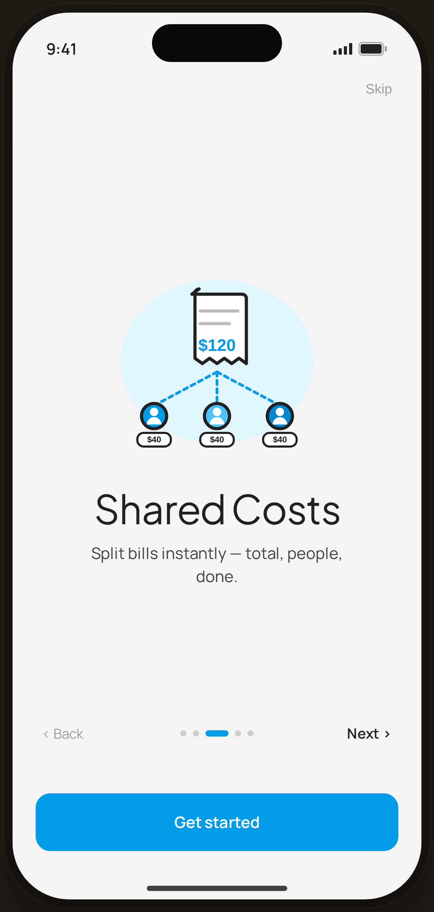

# Onboarding · Shared Costs — Flow 04 · First Launch

`04-onb-3` · onboarding · artboard 414×868

## Purpose
Third slide of the onboarding carousel (`<ScreenOnboardingHi slide={3} />`). Introduces bill-splitting.

## Layout (top → bottom)
- Phone chrome.
- **Top bar** — right-aligned "Skip".
- **Hero block** (flex-1, centered): 280px illustration `IlloSharedCosts`, title "Shared Costs" (serif 38px), body below (max-width 280px).
- **Nav row**: "‹ Back", 5 dots (dot 3 expanded), "Next ›".
- **CTA**: bottom-anchored primary "Get started".

## Components & content
- Copy: `Skip`, `Shared Costs`, `Split bills instantly — total, people, done.`, `‹ Back`, `Next ›`, `Get started`.
- DS components: `Button` primary/lg/fullWidth.
- Illustration `IlloSharedCosts`: a white receipt reading "$120" with three dashed lines fanning out to three person avatars (blue / blue-300 / blue-deep), each tagged "$40" — on a blue-50 blob.

## Typography & color
- Title `--serif` 38px -0.02em; body `--sans` 15px `--ink-2`.
- Active dot & button `--clay` #039be5; receipt total/glyphs in blue.

## States & interactions
- Slide 3 of 5: Back/Skip/Next active; "Get started" present. Dots animate.

## Implementation notes
- Driven by `slide={3}`; copy/illustration from `slides[]` + `ONBOARD_ILLOS`. Static prototype. Reuses `PhoneShell`, `Button`.
