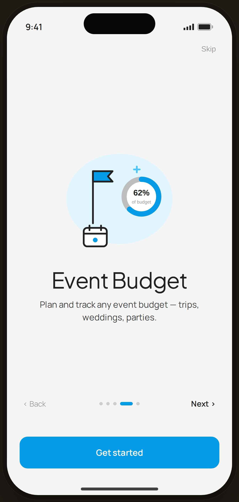

# Onboarding · Event Budget — Flow 04 · First Launch

`05-onb-4` · onboarding · artboard 414×868

## Purpose
Fourth slide of the onboarding carousel (`<ScreenOnboardingHi slide={4} />`). Introduces event budgeting.

## Layout (top → bottom)
- Phone chrome.
- **Top bar** — right-aligned "Skip".
- **Hero block** (flex-1, centered): 280px illustration `IlloEventBudget`, title "Event Budget" (serif 38px), body below (max-width 280px).
- **Nav row**: "‹ Back", 5 dots (dot 4 expanded), "Next ›".
- **CTA**: bottom-anchored primary "Get started".

## Components & content
- Copy: `Skip`, `Event Budget`, `Plan and track any event budget — trips, weddings, parties.`, `‹ Back`, `Next ›`, `Get started`.
- DS components: `Button` primary/lg/fullWidth.
- Illustration `IlloEventBudget`: a dark-line flag/destination pin, a blue progress ring reading "62% of budget", and a small calendar — on a blue-50 blob.

## Typography & color
- Title `--serif` 38px -0.02em; body `--sans` 15px `--ink-2`.
- Active dot & button `--clay` #039be5; progress ring blue #039be5.

## States & interactions
- Slide 4 of 5: Back/Skip/Next active; "Get started" present. Dots animate.

## Implementation notes
- Driven by `slide={4}`; copy/illustration from `slides[]` + `ONBOARD_ILLOS`. Static prototype. Reuses `PhoneShell`, `Button`.
