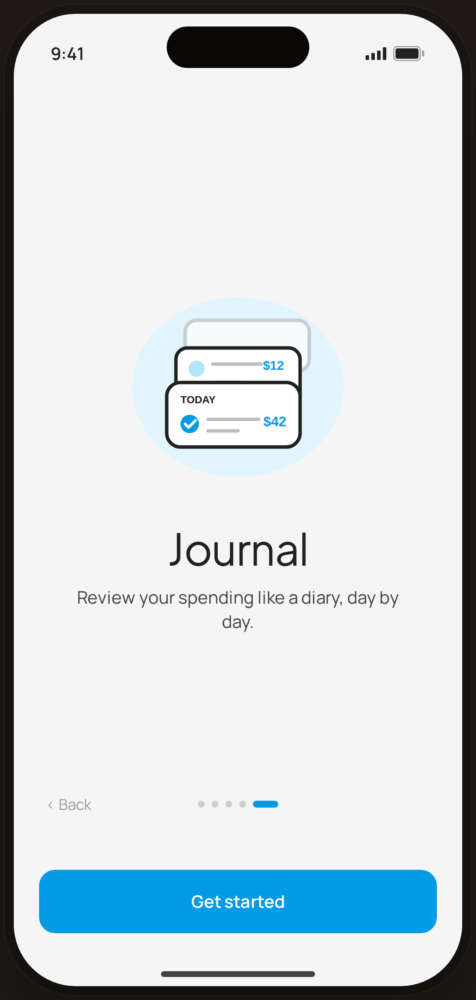

# Onboarding · Journal — Flow 04 · First Launch

`06-onb-5` · onboarding · artboard 414×868

## Purpose
Fifth and final slide of the onboarding carousel (`<ScreenOnboardingHi slide={5} />`). Introduces the diary-style Journal and is the natural end-of-tour.

## Layout (top → bottom)
- Phone chrome.
- **Top bar** — "Skip" is **hidden** on the last slide (`!isLast`).
- **Hero block** (flex-1, centered): 280px illustration `IlloJournal`, title "Journal" (serif 38px), body below (max-width 280px).
- **Nav row**: left "‹ Back" active, center 5 dots (dot 5 expanded), right "Next ›" rendered **transparent/hidden** on the last slide.
- **CTA**: bottom-anchored primary "Get started" — the prominent finish action.

## Components & content
- Copy: `Journal`, `Review your spending like a diary, day by day.`, `‹ Back`, `Get started`. (No "Skip", no "Next" on this slide.)
- DS components: `Button` primary/lg/fullWidth.
- Illustration `IlloJournal`: three stacked white day-cards (a "TODAY" card front), entry rows with blue check badges and amounts "$12" / "$42" — on a blue-50 blob.

## Typography & color
- Title `--serif` 38px -0.02em; body `--sans` 15px `--ink-2`.
- Active dot (5) & button `--clay` #039be5; inactive dots `rgba(43,31,23,0.18)`.

## States & interactions
- Slide 5 of 5 (`isLast`): Skip and Next › are removed (transparent) so "Get started" is the single forward action. Back remains. Dots show position 5.

## Implementation notes
- Driven by `slide={5}`; `isLast` toggles Skip/Next visibility. Copy/illustration from `slides[]` + `ONBOARD_ILLOS`. Static prototype. Reuses `PhoneShell`, `Button`.
