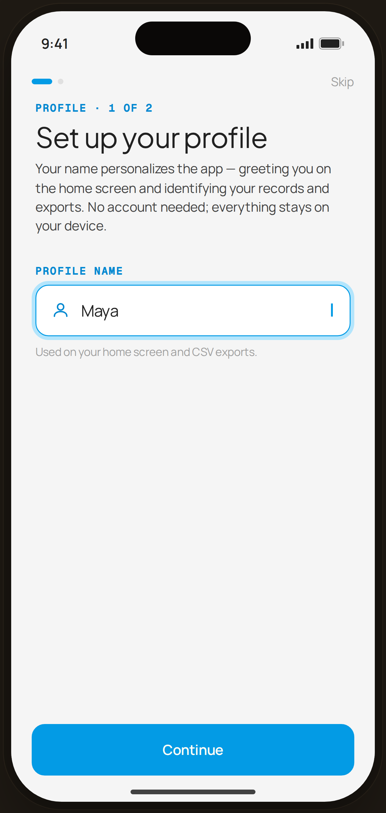

# Set Up Your Profile — Flow 04 · Profile Setup
`01-prof-name` · first-run personalization · artboard 414×868

## Purpose
First step of the account-free, on-device profile wizard. Captures a display name used to greet the user on the home screen and to identify records and CSV exports. No account is created; everything stays local.

## Layout (top → bottom)
1. **Status bar** (PhoneShell chrome) — `9:41`, signal + battery, dynamic island.
2. **Wizard header** (`WizHeader`, step 1 of 2) — progress dots left, `Skip` link right.
3. **Wizard title block** (`WizTitle`) — mono kicker, serif title, sans sub-paragraph.
4. **Profile name field** — mono label, focused text input with leading `user` icon, blinking cursor at the trailing edge.
5. **Helper caption** under the field.
6. **Spacer** (`marginTop: auto`) pushing the CTA to the bottom.
7. **CTA** — full-width `Continue` primary button with bottom safe-area padding.

## Components & content
- `WizHeader step={1} total={2}` — two progress dots; dot 1 is the active pill (`width 22`, `--blue-500`), dot 2 idle (`width 6`, `--gray-300`). `Skip` text shown.
- `WizTitle` — kicker `Profile · 1 of 2`; title `Set up your profile`; sub `Your name personalizes the app — greeting you on the home screen and identifying your records and exports. No account needed; everything stays on your device.`
- Field label: `Profile name` (mono, uppercased).
- Input container: focused state — `--card` background, `1.4px solid var(--blue-500)` border, `14px` radius, `0 0 0 4px var(--blue-100)` focus ring, padding `0 16px`.
  - Leading `Icon name="user"`, size 20, stroke `--blue-700`, strokeWidth 1.8.
  - `<input type="text">` defaultValue `Maya`, placeholder `e.g. Maya`, font sans 17px `--ink`, vertical padding `15px 0`.
  - Trailing `.proto-cursor` — 2px blinking caret (`--clay`, blink 1.05s).
- Helper caption: `Used on your home screen and CSV exports.` (12px, `--muted`).
- CTA: `Button variant="primary" size="lg" fullWidth` → `Continue`.

## Typography & color
- Kicker / field label — `--mono` 11px, weight 600, uppercase, letter-spacing 0.08em, color `--blue-700`.
- Title — `--serif` 30px, line-height 1.08, letter-spacing -0.015em, color `--ink`.
- Sub — `--sans` 14px, line-height 1.45, color `--ink-2`.
- Input text — `--sans` 17px, `--ink`.
- Helper — `--sans` 12px, `--muted` (`#9e9e9e`).
- CTA — `--sans` 600, 15px (lg), text `#fffdf6` on `--clay` (`#039be5`), radius 14px.
- Focus ring — `--blue-100` (`#b3e5fc`); active border `--blue-500` (`#039be5`).

## States & interactions
- Field is shown in **focused** state (blue border + 4px tint ring, blinking caret). Idle fields elsewhere use `--line` borders.
- `Skip` advances past the wizard without saving.
- `Continue` (primary) proceeds to step 2 (`02-prof-currency`); screen transitions on `slide-in-right` (280ms).
- Button press scales to 0.97 (`proto-tap`).

## Implementation notes
- Source: `static-profile-setup.jsx` → `ProfileName()`; shared `WizHeader` / `WizTitle` helpers in the same file.
- Wizard is 2 steps here (`total={2}`) even though `WizHeader` defaults to `total=4`; `ProfileName` explicitly passes 2.
- Column layout is `height:100%` flex; CTA pinned via `marginTop:auto`, not a fixed bottom bar.
- The input shows a hardcoded `defaultValue="Maya"` for the demo; production should start empty with the `e.g. Maya` placeholder.
