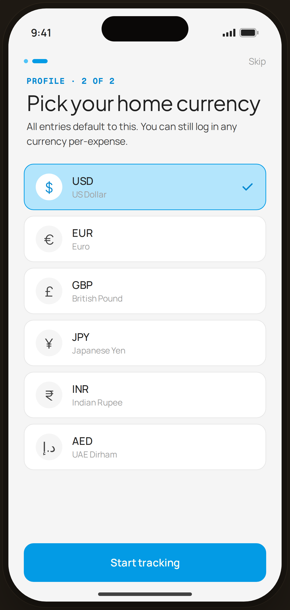

# Profile · Home currency — Flow 04 · Profile Setup

`prof-currency` · first-run personalization · artboard 414×868

## Purpose
Step 2 of 2 of the account-free first-run profile wizard (`<ProfileCurrency />`). User picks the home currency that defaults across the app.

## Layout (top → bottom)
- Phone chrome.
- **Wizard header** (`WizHeader step={2} total={2}`) — left: 2 progress pills (pill 2 = 22px blue bar active, pill 1 = blue-300 completed); right: "Skip".
- **Wizard title** (`WizTitle`): mono kicker "PROFILE · 2 OF 2" (blue-700), serif 30px title "Pick your home currency", sub-copy below.
- **Scrollable list** of 6 currency rows (each: round symbol chip · code + name · check when selected). USD is selected.
- **Bottom CTA**: primary "Start tracking", full-width.

## Components & content
- Copy: kicker `PROFILE · 2 OF 2`, title `Pick your home currency`, sub `All entries default to this. You can still log in any currency per-expense.`, CTA `Start tracking`, `Skip`.
- Currencies: USD · US Dollar (selected), EUR · Euro, GBP · British Pound, JPY · Japanese Yen, INR · Indian Rupee, AED · UAE Dirham.
- DS components: `Button` primary/lg/fullWidth.

## Typography & color
- Title `--serif` 30px, line-height 1.08, -0.015em, `--ink`.
- Kicker/labels `--mono` 11px uppercase 0.08em, `--blue-700` #0288d1.
- Selected row: `--blue-100` #b3e5fc bg, 1.4px `--blue-500` #039be5 border, white symbol chip with blue-700 glyph, blue-700 check. Unselected: `--card` white, `--line` border, gray-100 chip.

## States & interactions
- Single-select list (radio-like via highlighted row + check). USD shown selected. CTA always enabled.

## Implementation notes
- Selection hard-coded to USD (`c.code === 'USD'`). `CURRENCIES` array is local. Static prototype. Alternate "all currencies" picker is `prof-currency-sheet`. Reuses `PhoneShell`, `WizHeader`, `WizTitle`, `Button`, `Icon`.
