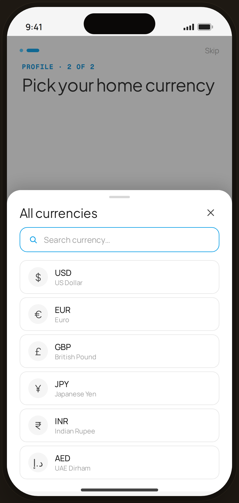

# Profile · Currency picker (sheet) — Flow 04 · Profile Setup

`prof-currency-sheet` · first-run personalization · artboard 414×868

## Purpose
Alternate state of the currency step (`<ProfileCurrencySheet />`): a full "All currencies" bottom sheet with search, for when the short list isn't enough.

## Layout (top → bottom)
- Phone chrome with the Profile step-2 screen dimmed behind (wizard header + serif title "Pick your home currency" visible at top).
- **Bottom sheet** (`EdgeBottomSheet`, height 560) over a `rgba(33,33,33,0.42)` scrim:
  - Drag handle (36×4) + title "All currencies" + close icon.
  - **Search field** — blue-outlined, search icon + "Search currency…" placeholder.
  - **Currency list** — 6 rows (round symbol chip · code + name), no selection highlight in this state.

## Components & content
- Copy: sheet title `All currencies`, search placeholder `Search currency…`, kicker `PROFILE · 2 OF 2`, title `Pick your home currency`.
- Currencies: USD, EUR, GBP, JPY, INR, AED (symbol · code · name).

## Typography & color
- Sheet title `--serif` 22px -0.01em.
- Row code `--sans` 14.5px 500 `--ink`; name 11.5px `--muted`.
- Search field: `--card`, 1.4px `--blue-500` border, blue search icon, `--muted` placeholder.
- Symbol chips: `--gray-100` bg, serif symbol `--ink-2`.

## States & interactions
- Modal sheet over scrim; tapping the search field would filter the list (visual only here). Rows are tappable to choose a currency.

## Implementation notes
- `EdgeBottomSheet` (scrim + rounded top + handle). List from local `CURRENCIES`. Static prototype — search/selection inert. Reuses `PhoneShell`, `WizHeader`, `WizTitle`, `Icon`.
