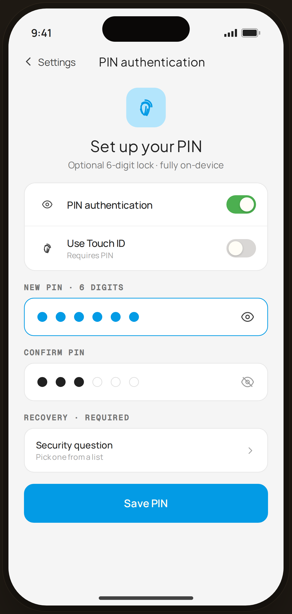

# PIN Setup — Flow 05 · PIN Auth

`pin-setup` · artboard 414×868

## Purpose
Create an optional 6-digit app lock (`<ScreenPinSetupHi />`), reached from Settings. Entirely on-device; pairs with a required security question for recovery.

## Layout (top → bottom)
- Phone chrome.
- **NavBar** — left "‹ Settings" back, center serif title "PIN authentication", no right action.
- Scroll body (16px gap stack):
  - **Hero** — 56px blue-tint rounded square with fingerprint icon, serif "Set up your PIN", sub "Optional 6-digit lock · fully on-device".
  - **Toggle group** card — "PIN authentication" (on, sage), "Use Touch ID" (off, detail "Requires PIN").
  - **New PIN · 6 digits** — blue-outlined field with 6 filled dots + eye (reveal) icon.
  - **Confirm PIN** — field with 3 of 6 dots filled (ink) + eye-off icon.
  - **Recovery · required** — row "Security question / Pick one from a list" with chevron.
  - **Save PIN** primary button.

## Components & content
- Copy: `PIN authentication`, `Set up your PIN`, `Optional 6-digit lock · fully on-device`, `Use Touch ID` / `Requires PIN`, `New PIN · 6 digits`, `Confirm PIN`, `Recovery · required`, `Security question` / `Pick one from a list`, `Save PIN`.
- DS components: `Button` primary/lg/fullWidth; custom `ToggleRow` (42×26 pill switch).

## Typography & color
- Hero title & section content serif/sans per scale; `SectionTitle` mono 11px uppercase `--ink-3`.
- New-PIN dots & active field border: `--clay` #039be5; confirm dots `--ink`; toggle ON track `--sage` #4caf50 with white knob.

## States & interactions
- New PIN shows all 6 filled; Confirm shows partial (3/6) entry in progress. Touch ID disabled until a PIN exists. Security question is mandatory before Save.

## Implementation notes
- Dot fill is illustrative (`i <= 6` / `i <= 3`). `ToggleRow`, `EyeOff` are local. Static prototype. Reuses `PhoneShell`, `NavBar`, `BackBtn`, `SectionTitle`, `Button`, `Icon`.
