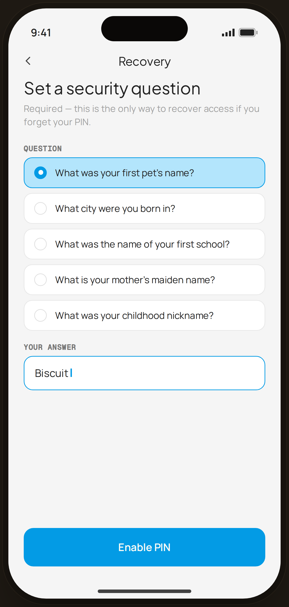

# PIN · Security question — Flow 05 · PIN Auth

`pin-security` · artboard 414×868

## Purpose
Mandatory recovery step in PIN setup (`<PinSecurityQuestion />`). The user picks one security question and types an answer — the only way to recover access if the PIN is forgotten.

## Layout (top → bottom)
- Phone chrome.
- **NavBar** — back arrow (no label), center title "Recovery".
- Scroll body:
  - Serif 24px title "Set a security question", muted sub explaining it's required for recovery.
  - **Question** label, then 5 single-select radio rows (first selected, blue highlight).
  - **Your answer** label, then a blue-outlined field showing typed "Biscuit" with a caret.
- **Bottom CTA**: primary "Enable PIN", full-width.

## Components & content
- Copy: `Recovery`, `Set a security question`, `Required — this is the only way to recover access if you forget your PIN.`, `Question`, `Your answer`, answer `Biscuit`, CTA `Enable PIN`.
- Questions: "What was your first pet's name?" (selected), "What city were you born in?", "What was the name of your first school?", "What is your mother's maiden name?", "What was your childhood nickname?".

## Typography & color
- Title `--serif` 24px -0.01em; labels `--mono` 10.5px uppercase `--ink-3`.
- Selected row & answer field: `--blue-100` bg / 1.4px `--blue-500` border; radio dot blue with white center.

## States & interactions
- Single-select question list (radio). Answer field focused with caret. CTA enables PIN once a question + answer are set.

## Implementation notes
- Selection hard-coded to first question (`i === 0`). `qs` array local. Static prototype — caret is the `proto-cursor` element. Reuses `PhoneShell`, `NavBar`, `BackBtn`, `NavLabel`, `Button`, `Icon`.
