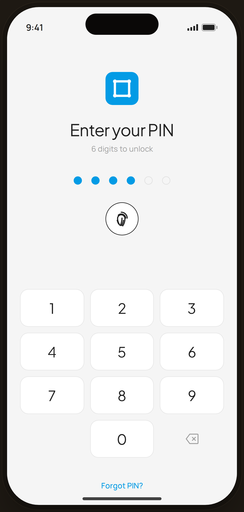

# PIN Entry · 4 of 6 — Flow 05 · PIN Auth

`pin-entry` · artboard 414×868

## Purpose
The lock screen shown on app open when PIN auth is enabled (`<ScreenPinEntryHi filled={4} />`). Captured mid-entry with 4 of 6 digits in.

## Layout (top → bottom)
- Phone chrome.
- **Centered stack** (top-aligned, padded 60px):
  - 56px blue (`--clay`) rounded app-icon tile (Pro Expense glyph).
  - Serif 28px "Enter your PIN", muted sub "6 digits to unlock".
  - **PIN dots** — 6 dots, 16px gap; first 4 filled blue, last 2 outlined.
  - **Biometric** — 56px circular outline button with fingerprint icon.
- **Keypad** — 3-column serif numeric pad (1–9, 0, backspace glyph).
- **Forgot PIN?** link (blue) at the bottom.

## Components & content
- Copy: `Enter your PIN`, `6 digits to unlock`, digits 0–9, `Forgot PIN?`.
- Custom inline keypad (not the Flow-01 Keypad); backspace is an SVG glyph.

## Typography & color
- Title `--serif` 28px -0.015em `--ink`; sub `--muted`.
- Filled dots & accents `--clay` #039be5; outlines `--line-strong`.
- Keys: `--card` bg, serif 24px `--ink`, `--line` border. "Forgot PIN?" `--clay` 500.

## States & interactions
- `filled={4}`: shows 4/6 entered (transition 120ms per dot). Biometric available (not locked). "Forgot PIN?" routes to recovery.

## Implementation notes
- `filled` prop drives dot fill; `locked`/`attempts` props (unused here) drive the lockout variant (`pin-lock`). Static prototype — keypad inert. Reuses `PhoneShell`, `Icon`.
