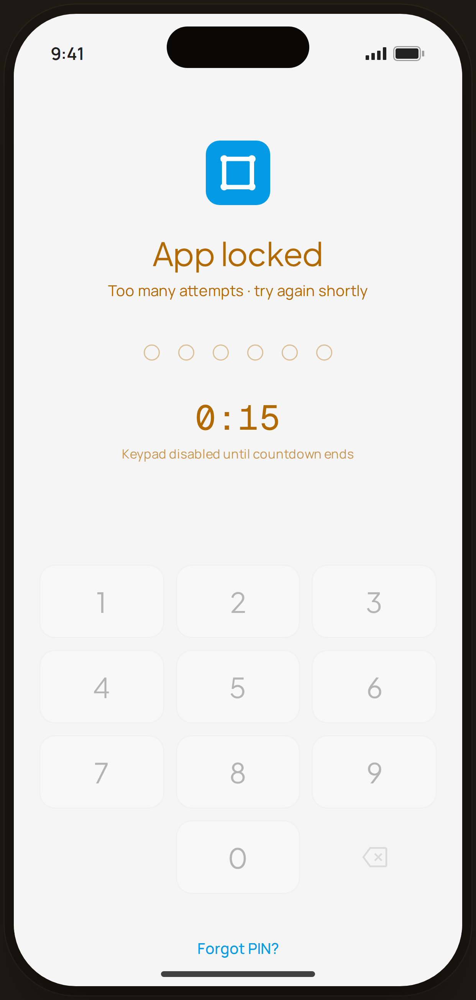

# PIN Entry · Lockout — Flow 05 · PIN Auth

`pin-lock` · validation state · artboard 414×868

## Purpose
The locked-out variant of PIN entry (`<ScreenPinEntryHi filled={0} locked attempts={3} />`), shown after too many wrong attempts. The keypad is disabled behind a countdown.

## Layout (top → bottom)
- Phone chrome.
- **Centered stack**: 56px blue app-icon tile; serif 28px "App locked" (amber), sub "Too many attempts · try again shortly" (amber).
- **PIN dots** — 6 empty dots, amber-tinted outline (no fill while locked).
- **Countdown** — large mono timer "0:15" in amber with caption "Keypad disabled until countdown ends" (replaces the biometric button).
- **Keypad** — same 3-column pad but dimmed to 30% opacity (disabled).
- **Forgot PIN?** link at bottom.

## Components & content
- Copy: `App locked`, `Too many attempts · try again shortly`, timer `0:15`, `Keypad disabled until countdown ends`, `Forgot PIN?`.

## Typography & color
- Title & sub amber `#b26a00`; dots outline `rgba(178,106,0,0.4)`.
- Timer `--mono` 30px `#b26a00`; caption `rgba(178,106,0,0.7)`.
- Keypad at `opacity: 0.3`.

## States & interactions
- `locked` true: dots stay empty, biometric hidden, keypad disabled, amber lock messaging + countdown. Timer derives from `attempts` (`0:${30 - attempts*5}` → 0:15 at 3 attempts).

## Implementation notes
- Same component as `pin-entry`, toggled by `locked`/`attempts` props. Countdown value is computed, not live. Static prototype. Reuses `PhoneShell`, `Icon`.
