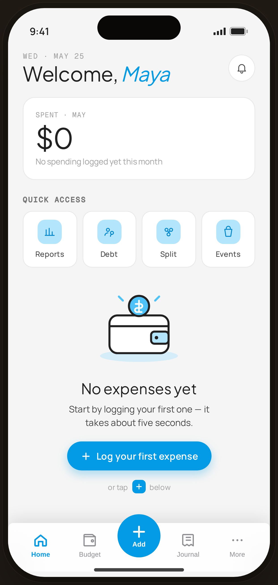

# Home · Fresh user (empty) — Flow 01 · Quick Log

`home-empty` · artboard 414×868

## Purpose
The Home screen for a brand-new user with no expenses (`<StaticHomeEmpty />`). Zero-state that nudges the first log.

## Layout (top → bottom)
- Phone chrome.
- **Header** (14×22): mono eyebrow "WED · MAY 25"; serif 30px greeting "Welcome, *Maya*" (Maya in blue italic); 40px round bell button (top-right).
- **Zero-state summary card** — mono "SPENT · MAY", serif 42px "$0", caption "No spending logged yet this month".
- **Quick access** — 4 tiles (Reports, Debt, Split, Events), blue-tint icon squares.
- **Empty recent block** (flex-1, centered): wallet-with-coin SVG illustration; serif 22px "No expenses yet"; body "Start by logging your first one — it takes about five seconds."; a blue pill CTA "＋ Log your first expense"; hint row "or tap [＋] below".
- **Floating bottom nav** (`ProtoBottomNav active="home"`) with raised Add button.

## Components & content
- Copy: `WED · MAY 25`, `Welcome, Maya`, `SPENT · MAY`, `$0`, `No spending logged yet this month`, `QUICK ACCESS`, tile labels `Reports/Debt/Split/Events`, `No expenses yet`, `Start by logging your first one — it takes about five seconds.`, `Log your first expense`, `or tap … below`.

## Typography & color
- Greeting & amounts `--serif` (30/42px); name accent `--blue-500` italic.
- Eyebrows/labels `--mono` uppercase `--muted`/`--ink-3`.
- CTA pill `--clay` #039be5 with white text and blue glow shadow; quick-access icons blue-700 on blue-100.

## States & interactions
- Zero state: "$0" summary + illustrated empty recent. Two affordances to add (pill CTA + nav ＋). Static prototype.

## Implementation notes
- Distinct component from the populated `StaticHome` (different greeting "Welcome" vs "Hi"). Reuses `PhoneShell`, `ProtoBottomNav`, `Icon`. Illustration is inline SVG.
