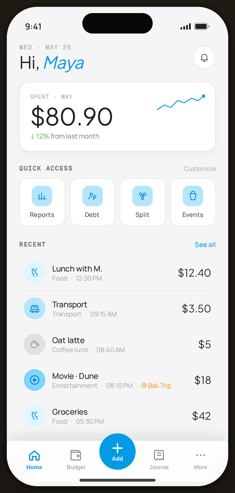

# Home · Casual — Flow 01 · Quick Log

`home-casual` · artboard 414×868

## Purpose
The populated Home for the default "casual" persona (`<StaticHome persona="casual" />`). Spend-summary + recent transactions — the app's main landing screen.

## Layout (top → bottom)
- Phone chrome.
- **Header** (14×22): mono "WED · MAY 25"; serif 30px "Hi, *Maya*" (blue italic name); 40px round bell button.
- **Context header card** (`ContextHeader` casual): mono "SPENT · MAY"; serif 42px "$80.90"; caption "↓ 12% from last month" (sage delta); decorative blue `SparkLine`.
- **Quick access** — header row "QUICK ACCESS / Customize"; 4 tiles Reports / Debt / Split / Events.
- **Recent** — header "RECENT / See all"; transaction rows (`TxnRow`): CatBadge · note over "category · time" · serif amount. One row carries an orange `@ Bali Trip` event tag.
- **Floating bottom nav** (`active="home"`).

## Components & content
- Transactions: Lunch with M. · Food · 12:30 PM · $12.40; Transport · 09:15 AM · $3.50; Oat latte · Coffee runs · 08:40 AM · $5.00; Movie · Dune · Entertainment · 08:10 PM · @Bali Trip · $18.00; Groceries · Food · 05:30 PM · $42.00.
- Copy: `Hi, Maya`, `SPENT · MAY`, `$80.90`, `↓ 12% from last month`, `QUICK ACCESS`, `Customize`, `RECENT`, `See all`.

## Typography & color
- Amounts/greeting `--serif`; eyebrows `--mono` `--muted`; rows `--sans` 14px.
- Name & links `--clay` #039be5; delta `--sage` #4caf50; event tag `--tag` #fb8c00 with `at` icon.

## States & interactions
- Casual persona shows month spend + trend. Tapping the card cycles personas (casual→budget→event) in the interactive build; static here.

## Implementation notes
- `persona="casual"` selects the `ContextHeader` variant; seed `expenses[]` is the default mock list. Reuses `HomeScreen`, `ContextHeader`, `TxnRow`, `QuickAccess`, `ProtoBottomNav`.
