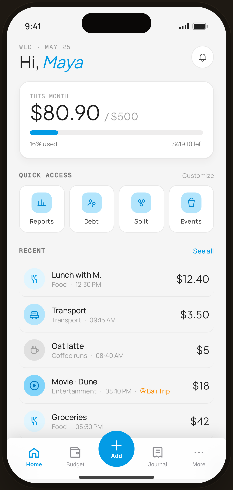

# Home · Budget Planner — Flow 01 · Quick Log

`home-budget` · artboard 414×868

## Purpose
Home for the "budget" persona (`<StaticHome persona="budget" />`). Same screen, but the context card reframes the month as spend-against-budget.

## Layout (top → bottom)
- Phone chrome; header identical to casual ("Hi, *Maya*", bell).
- **Context header card** (`ContextHeader` budget): mono "THIS MONTH"; serif spend "$80.90" with serif "/ $500" budget; **progress bar** (blue fill at % used); footer row "16% used · $419.10 left".
- **Quick access** — 4 tiles.
- **Recent** — same transaction rows as casual.
- **Floating bottom nav** (`active="home"`).

## Components & content
- Copy: `THIS MONTH`, `$80.90 / $500`, `16% used`, `$419.10 left`. (Budget = $500 hard-coded; total derived from the 5 seed expenses ≈ $80.90.)
- Same recent transactions as `home-casual`.

## Typography & color
- Spend serif 36px, budget serif 18px `--muted`.
- Progress track `rgba(43,31,23,0.08)`, fill `--clay` #039be5; footer `--ink-3`.

## States & interactions
- Budget persona: progress bar + remaining figure. Card cycles personas in interactive build; static here.

## Implementation notes
- `persona="budget"` branch of `ContextHeader`; `pct = min(100, total/budget*100)`. Reuses `HomeScreen`, `TxnRow`, `QuickAccess`, `ProtoBottomNav`.
