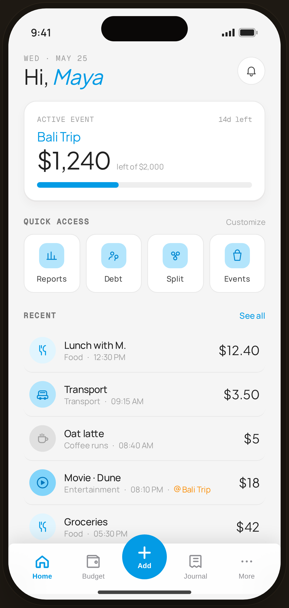

# Home · Event Organizer — Flow 01 · Quick Log

`home-event` · artboard 414×868

## Purpose
Home for the "event" persona (`<StaticHome persona="event" />`). The context card surfaces the active event budget instead of the month total.

## Layout (top → bottom)
- Phone chrome; header identical ("Hi, *Maya*", bell).
- **Context header card** (`ContextHeader` event): top row mono "ACTIVE EVENT" / "14d left"; serif 18px event name "Bali Trip" (blue); serif 34px "$1,240" with caption "left of $2,000"; **progress bar** (blue fill at spent %).
- **Quick access** — 4 tiles.
- **Recent** — same transaction rows.
- **Floating bottom nav** (`active="home"`).

## Components & content
- Copy: `ACTIVE EVENT`, `14d left`, `Bali Trip`, `$1,240`, `left of $2,000`. (Mock event: remaining 1240 / budget 2000 / 14 days.)
- Same recent transactions as `home-casual`.

## Typography & color
- Event name & remaining amount `--blue-500` #039be5 (serif); progress fill `--blue-500` on `--gray-200` track.

## States & interactions
- Event persona: shows the single active event's remaining budget + days left. Card cycles personas in interactive build; static here.

## Implementation notes
- `persona="event"` branch of `ContextHeader` with inline `ev` mock. Reuses `HomeScreen`, `TxnRow`, `QuickAccess`, `ProtoBottomNav`.
