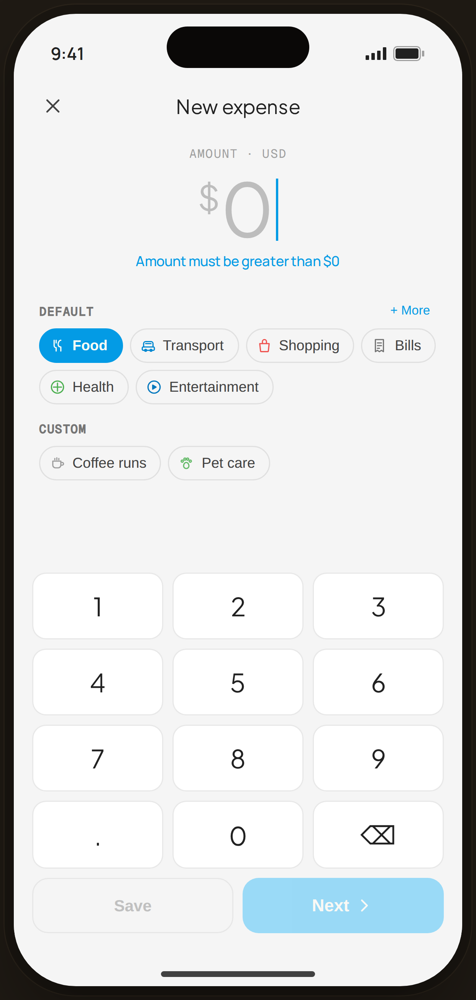

# Add Expense · Amount · $0 validation — Flow 01 · Quick Log

`add-zero` · validation state · artboard 414×868

## Purpose
The "Amount" step of Add Expense in its zero/invalid state (`<StaticAddAmount amount="" shake />`). Demonstrates the $0 guard: the amount shakes and a helper message appears, and the action buttons are disabled.

## Layout (top → bottom)
- Phone chrome.
- **Nav** — close (✕) left, serif "New expense" center.
- **Amount zone** (centered): mono eyebrow "AMOUNT · USD"; giant serif "$0" placeholder in muted color (with shake animation); helper line "Amount must be greater than $0" in blue.
- **Categories** — "DEFAULT" chips row (`CatChip`, Food selected) + "＋ More"; "CUSTOM" chips row.
- **Keypad** — 3-col serif numeric pad (1–9, ., 0, ⌫); action row "Save" (secondary) + "Next ›" (primary) — both **disabled/dimmed** because amount is $0.

## Components & content
- Copy: `New expense`, `AMOUNT · USD`, `$0` (placeholder), `Amount must be greater than $0`, `DEFAULT`, `+ More`, `CUSTOM`, `Save`, `Next`.
- DS components: `CatChip` (selected = filled accent), `Keypad`/`KeyBtn`.

## Typography & color
- Amount `--serif` 64px -0.025em; placeholder color `--muted-2`, `$` glyph also muted.
- Helper `--clay` #039be5 500. Disabled buttons: Next on `--clay-soft`, Save outlined, both `opacity ~0.55–0.6`, `cursor: not-allowed`.

## States & interactions
- `shake` triggers the `proto-shake` keyframe (frozen here) + helper text. `canProceed=false` disables Save/Next until amount > 0.

## Implementation notes
- `amount=""` → `amountToFloat` 0 → `canProceed` false. Reuses `AddAmountScreen`, `Keypad`, `CatChip`, `PhoneShell`. Categories from `DEFAULT_CATEGORY_IDS`/`CUSTOM_CATEGORY_IDS`.
