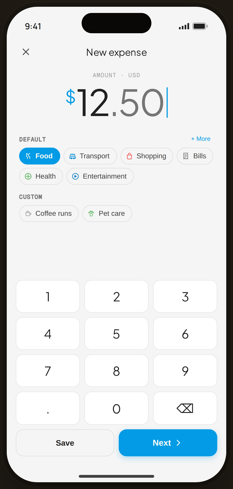

# Add Expense · Amount · typed — Flow 01 · Quick Log

`add-amount` · artboard 414×868

## Purpose
The "Amount" step with a valid value entered (`<StaticAddAmount amount="12.50" />`). The happy-path of step 1 — amount + category, ready to proceed.

## Layout (top → bottom)
- Phone chrome.
- **Nav** — close (✕), serif "New expense".
- **Amount zone**: mono "AMOUNT · USD"; serif "$12.50" — whole part in ink, decimals in `--ink-3`, blue "$" — with blinking caret.
- **Categories** — DEFAULT chips (Food selected) + "＋ More"; CUSTOM chips.
- **Keypad** — numeric pad; action row "Save" (secondary, enabled) + "Next ›" (primary, enabled with blue fill + shadow).

## Components & content
- Copy: `New expense`, `AMOUNT · USD`, `$12.50`, `DEFAULT`, `+ More`, `CUSTOM`, `Save`, `Next`.
- DS components: `CatChip` (Food selected), `Keypad`.

## Typography & color
- Amount `--serif` 64px; `$` glyph `--clay`; decimals `--ink-3`.
- Next button: `--clay` #039be5 fill, white text, blue shadow; Save: outlined `--line-strong`, `--ink`.

## States & interactions
- `canProceed=true` (amount 12.50 > 0): both Save (quick-save) and Next (→ Details) enabled. Caret rendered via `proto-cursor`.

## Implementation notes
- `amount="12.50"` formatted by `formatAmount`. Reuses `AddAmountScreen`, `Keypad`, `CatChip`, `PhoneShell`. Next routes to the Details step (`add-details`).
