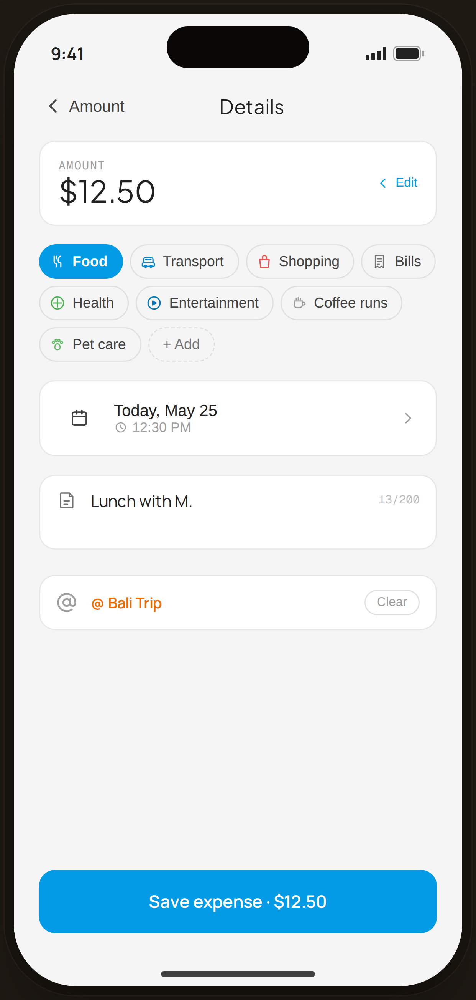

# Add Expense · Details (with @ tag) — Flow 01 · Quick Log

`add-details` · artboard 414×868

## Purpose
Step 2 of Add Expense (`<StaticAddDetails />`): refine the entry — confirm amount, category, date/time, note, and an optional @event/@debt link — then save.

## Layout (top → bottom)
- Phone chrome.
- **Nav** — back "‹ Amount", serif "Details" center.
- Scroll body (16px gap):
  - **Amount summary** card (read-only) — "AMOUNT" + serif "$12.50", with blue "Edit" affordance (taps back).
  - **Category** chips row (Food selected) + dashed "＋ Add".
  - **Date & time** row — calendar icon, "Today, May 25" + clock "12:30 PM", chevron.
  - **Note** field — note icon + textarea "Lunch with M." + "13/200" counter.
  - **@ tag** — filled state showing linked event "@ Bali Trip" (orange) with a "Clear" pill.
- **Bottom CTA**: primary "Save expense · $12.50", full-width.

## Components & content
- Copy: `Details`, `AMOUNT`, `$12.50`, `Edit`, `Today, May 25`, `12:30 PM`, note `Lunch with M.`, `/200` counter, `@ Bali Trip`, `Clear`, `Save expense · $12.50`.
- DS components: `CatChip`, `Button` primary/lg/fullWidth.

## Typography & color
- Summary amount `--serif` 26px; section fields `--card` w/ `--line` borders, 14px radius.
- Linked-tag text `--tag-deep` #ef6c00 600; note counter `--muted-2` (turns `--clay` at 200 cap).

## States & interactions
- `tag` preset to event `bali` → renders the filled tag row with Clear. Note ≤ 200 chars. Tapping the amount/Edit returns to step 1; date/time + @tag open bottom sheets in the interactive build (`DateTimeSheet`, `TagPickerSheet`).

## Implementation notes
- `showTagPicker` true; draft preset (amount 12.50, category food, note, tag event/bali). Reuses `AddDetailsScreen`, `CatChip`, `Button`, `Icon`. @tag picker enforces event-OR-debt exclusivity (see edge `edge-tag`).
