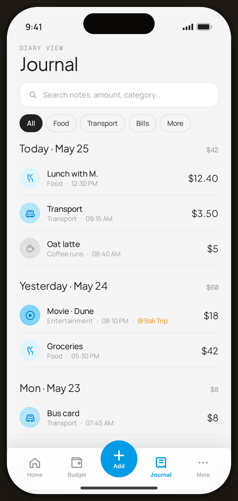

# Journal · date-grouped — Flow 02 · Browse Journal

`journal-list` · artboard 414×868

## Purpose
The diary view of all expenses (`<ScreenJournalHi />`), grouped by day with running totals — the primary browse surface.

## Layout (top → bottom)
- Phone chrome.
- **Header** (14×22): mono "DIARY VIEW"; serif 32px "Journal".
- **Search field** — card, search icon + placeholder "Search notes, amount, category…".
- **Filter chips** — All (active/ink), Food, Transport, Bills, More.
- **Day groups** (scroll): each has a serif 18px day header + mono total on the right, then transaction rows (CatBadge 36 · note/category·time · serif amount). One row shows an orange `@ Bali Trip` tag.
- **Floating bottom nav** (`active="journal"`).

## Components & content
- Groups: **Today · May 25** ($42): Lunch with M. (Food 12:30 PM $12.40), Transport (09:15 AM $3.50), Oat latte (Coffee runs 08:40 AM $5.00). **Yesterday · May 24** ($60): Movie · Dune (Entertainment 08:10 PM @Bali Trip $18.00), Groceries (Food 05:30 PM $42.00). **Mon · May 23** ($8): Bus card (Transport 07:45 AM $8.00).
- Copy: `DIARY VIEW`, `Journal`, `Search notes, amount, category…`, filter labels.

## Typography & color
- Title & day headers `--serif`; totals `--mono` `--muted`; rows `--sans`.
- Active filter chip `--ink` fill / `--paper-warm` text; event tag `--tag` #fb8c00.

## States & interactions
- Rows divided by `--line-2` hairlines. Filters/search are visual here; long-press → quick note in interactive build (see `edge-quicknote`). Tapping a row → `journal-detail`.

## Implementation notes
- `days[]` mock is local; totals are authored, not summed. Reuses `PhoneShell`, `CatBadge`, `ProtoBottomNav`, `Icon`, `currencyFmt`. `FilterChip` is local.
