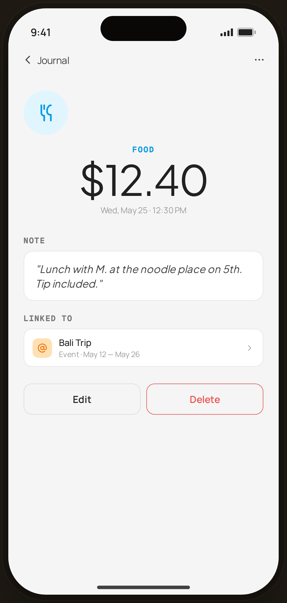

# Journal Detail · linked to Event — Flow 02 · Browse Journal

`journal-detail` · artboard 414×868

## Purpose
A single expense's detail view (`<ScreenJournalDetailHi />`), showing amount, note, its event link, and edit/delete actions.

## Layout (top → bottom)
- Phone chrome.
- **NavBar** — back "‹ Journal", no title, right "⋯" more icon.
- Scroll body:
  - **Hero** (centered): 64px CatBadge (food); mono category "FOOD" (in category color); serif 60px "$12.40"; caption "Wed, May 25 · 12:30 PM".
  - **Note** section — `SectionTitle` "NOTE" + serif italic quote card: "Lunch with M. at the noodle place on 5th. Tip included."
  - **Linked to** section — card with orange `@` chip, "Bali Trip" / "Event · May 12 — May 26", chevron.
  - **Actions** — "Edit" (secondary) + "Delete" (secondary, red text/border).

## Components & content
- Copy: `FOOD`, `$12.40`, `Wed, May 25 · 12:30 PM`, `NOTE`, the italic note, `Linked to`, `Bali Trip`, `Event · May 12 — May 26`, `Edit`, `Delete`.
- DS components: `CatBadge` 64; `Button` secondary ×2 (Delete tinted danger).

## Typography & color
- Amount `--serif` 60px -0.025em; category eyebrow uses `CATEGORIES.food.color`.
- Note in `--serif` italic `--ink-2`; linked chip on `--tag-tint` with `--tag-deep` `at` icon.
- Delete button text/border `--danger` #ef5350 / danger-soft.

## States & interactions
- Read view; "⋯" / Delete open the edit-or-delete action sheet (`journal-actions`). Linked-event row is tappable.

## Implementation notes
- Single hard-coded record. Reuses `PhoneShell`, `NavBar`, `BackBtn`, `SectionTitle`, `CatBadge`, `Button`, `Icon`.
