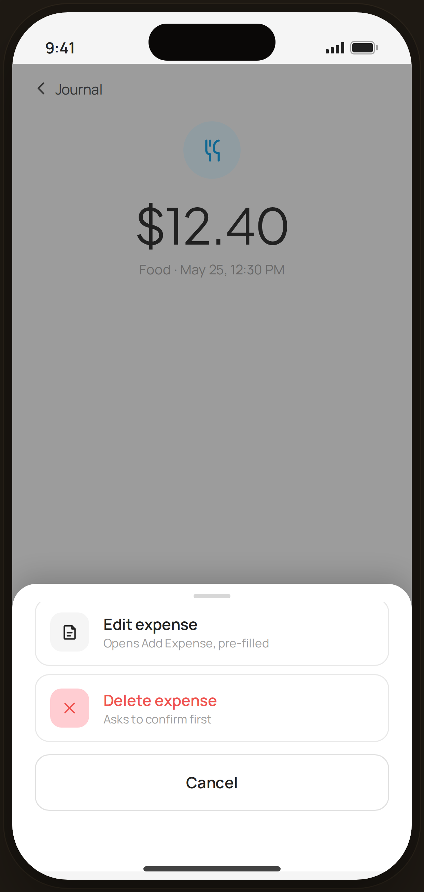

# Journal Detail · edit / delete sheet — Flow 02 · Browse Journal

`journal-actions` · artboard 414×868

## Purpose
The action bottom sheet over the journal detail (`<JournalDetailActions />`): choose to edit or delete the expense.

## Layout (top → bottom)
- Phone chrome with the detail behind: NavBar "‹ Journal", centered 56px CatBadge (food), serif 48px "$12.40", caption "Food · May 25, 12:30 PM".
- **Bottom sheet** (`EdgeBottomSheet`, height 280) over scrim:
  - **Edit expense** action row — note icon, "Edit expense" / "Opens Add Expense, pre-filled".
  - **Delete expense** action row — close icon, red, "Delete expense" / "Asks to confirm first".
  - **Cancel** secondary button, full-width.

## Components & content
- Copy: `$12.40`, `Food · May 25, 12:30 PM`, `Edit expense` / `Opens Add Expense, pre-filled`, `Delete expense` / `Asks to confirm first`, `Cancel`.
- DS components: `Button` secondary/lg/fullWidth; local `SheetAction` rows.

## Typography & color
- Sheet actions: icon tile (`--gray-100`, or `--danger-tint` for delete), label 15px 600, sub 11.5px `--muted`.
- Delete uses `--danger` #ef5350 for icon + label.

## States & interactions
- Modal sheet over `rgba(33,33,33,0.42)` scrim. Edit → Add Expense pre-filled; Delete → confirmation dialog (destructive). Cancel dismisses.

## Implementation notes
- `EdgeBottomSheet` with two `SheetAction`s. Static prototype. Reuses `PhoneShell`, `NavBar`, `BackBtn`, `CatBadge`, `Button`, `Icon`.
