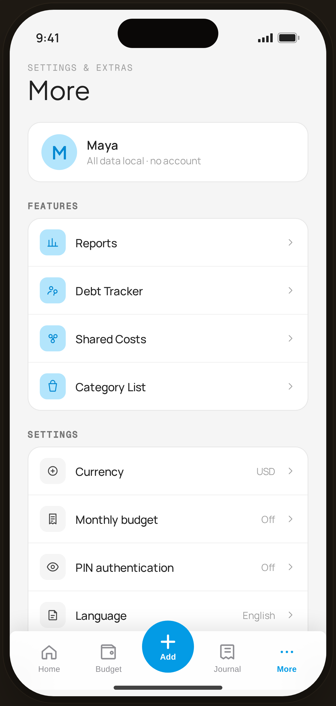

# More — Flow 03 · More

`more-hub` · settings hub · artboard 414×868

## Purpose
The settings & extras hub (`<ScreenMoreHi />`): profile summary plus grouped links to features, settings, and data tools.

## Layout (top → bottom)
- Phone chrome.
- **Header** (14×22): mono "SETTINGS & EXTRAS"; serif 32px "More".
- Scroll body:
  - **Profile card** — 44px round serif "M" avatar (blue), "Maya" / "All data local · no account".
  - **Features** group (`SettingsGroup`) — Reports, Debt Tracker, Shared Costs, Category List (blue-tint icons).
  - **Settings** group — Currency (USD), Monthly budget (Off), PIN authentication (Off), Language (English), Theme (System).
  - **Data** group — Export data (CSV · JSON), Clear data (destructive, red).
  - Footer "v0.1.0 · MVP".
- **Floating bottom nav** (`active="more"`).

## Components & content
- Copy: `SETTINGS & EXTRAS`, `More`, `Maya`, `All data local · no account`, group titles `Features`/`Settings`/`Data`, each row label + detail value, `v0.1.0 · MVP`.

## Typography & color
- Title `--serif` 32px; group titles `SectionTitle` mono uppercase `--ink-3`.
- Rows: 32px rounded icon tiles; detail values `--muted`; "Clear data" label/icon `--danger` #ef5350.

## States & interactions
- Tappable rows with right chevrons; each routes to its setting (Currency → `more-currency`, Export → `more-export`, Clear data → `more-clear`, PIN → Flow 05, Reports/Categories → Flow 03 screens).

## Implementation notes
- `SettingsGroup`/rows are data-driven from inline arrays. Reuses `PhoneShell`, `SectionTitle`, `ProtoBottomNav`, `Icon`.
