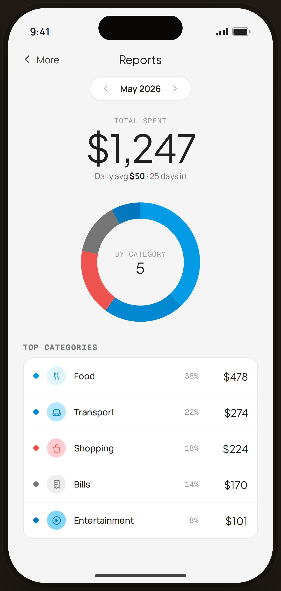

# Reports · monthly — Flow 03 · More

`reports` · artboard 414×868

## Purpose
The monthly spending report (`<ScreenReportsHi />`): total, a category donut, and a ranked top-categories list.

## Layout (top → bottom)
- Phone chrome.
- **NavBar** — back "‹ More", center "Reports".
- Scroll body:
  - **Period selector** — pill "‹ May 2026 ›".
  - **Total** (centered) — mono "TOTAL SPENT"; serif 56px "$1,247"; caption "Daily avg $50 · 25 days in".
  - **Donut** — 200px SVG ring split into 5 category segments; center reads "BY CATEGORY / 5".
  - **Top categories** card — 5 rows: color dot · CatBadge · label · mono % · serif amount.
- (No bottom nav — pushed view.)

## Components & content
- Segments: Food 38% $478, Transport 22% $274, Shopping 18% $224, Bills 14% $170, Entertainment 8% $101.
- Copy: `Reports`, `May 2026`, `TOTAL SPENT`, `$1,247`, `Daily avg $50 · 25 days in`, `BY CATEGORY`, `Top categories`.

## Typography & color
- Total `--serif` 56px -0.025em; eyebrows `--mono` `--muted`.
- Donut segment colors from `CATEGORIES[*].color`; track `rgba(43,31,23,0.08)`.

## States & interactions
- Static report. Period pill would page months; donut/list are read-only. The all-uncategorized variant is `edge-reports-unc`.

## Implementation notes
- Donut built from per-segment `strokeDasharray`/`strokeDashoffset` over `circumference = 2π·15.91`. `segs[]` local. Reuses `PhoneShell`, `NavBar`, `BackBtn`, `SectionTitle`, `CatBadge`, `currencyFmt`.
