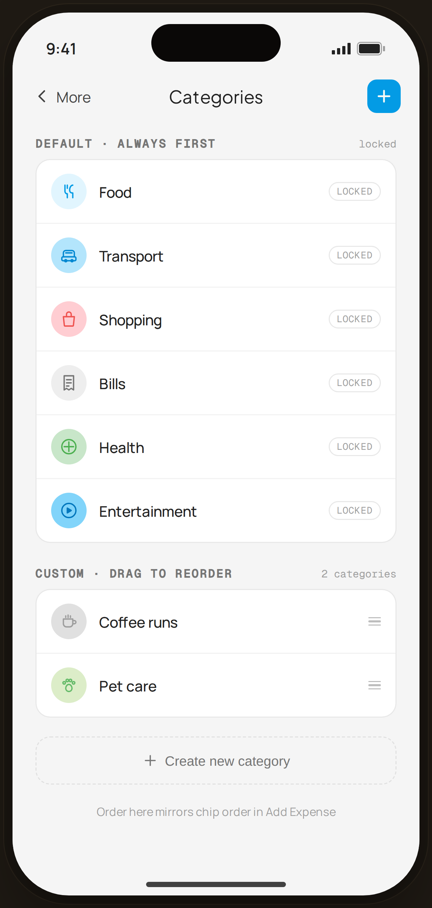

# Category List — Flow 03 · More

`categories` · artboard 414×868

## Purpose
Manage expense categories (`<ScreenCategoryListHi />`): locked defaults plus reorderable custom categories, and a create affordance.

## Layout (top → bottom)
- Phone chrome.
- **NavBar** — back "‹ More", center "Categories", right blue ＋ tile.
- Scroll body:
  - **Default · always first** group (with "locked" tag) — 6 rows: Food, Transport, Shopping, Bills, Health, Entertainment; each `CatBadge` + label + "locked" pill.
  - **Custom · drag to reorder** group ("2 categories") — Coffee runs, Pet care; each with a 3-line drag handle.
  - Dashed **"＋ Create new category"** button.
  - Footnote "Order here mirrors chip order in Add Expense".

## Components & content
- Copy: `Categories`, `Default · always first`, `locked`, `Custom · drag to reorder`, `2 categories`, `Create new category`, `Order here mirrors chip order in Add Expense`.
- Default ids: food, transport, shopping, bills, health, entertainment. Custom: coffee, pet.

## Typography & color
- Group titles `SectionTitle` mono uppercase `--ink-3`; rows `--sans` 14px.
- "locked" pill: mono 9px, `--muted`, `--line` border. Add ＋ tile `--clay` #039be5.

## States & interactions
- Defaults are locked (non-reorderable); customs show drag handles. Create opens the new-category sheet (duplicate-name guard → `edge-cat-dup`).

## Implementation notes
- `CategoryRow` renders `locked`/`draggable`/`first` variants. Lists from `CATEGORIES`. Reuses `PhoneShell`, `NavBar`, `BackBtn`, `SectionTitle`, `CatBadge`, `Icon`.
