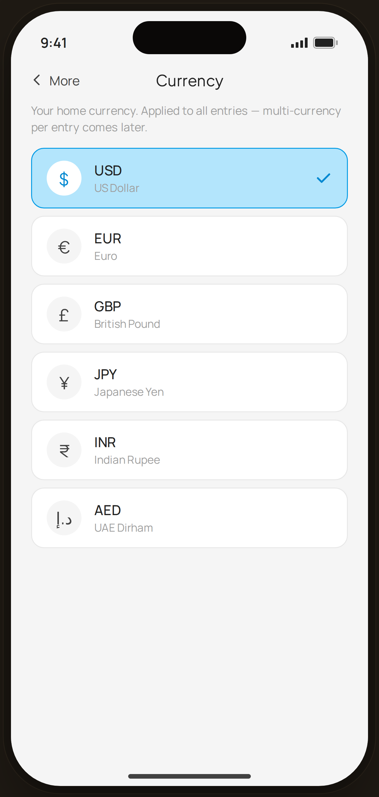

# Currency setting — Flow 03 · More

`more-currency` · artboard 414×868

## Purpose
Change the app's home currency from Settings (`<MoreCurrency />`). Single-select list; applies to all entries.

## Layout (top → bottom)
- Phone chrome.
- **NavBar** — back "‹ More", center "Currency".
- Scroll body: explanatory line, then a column of 6 currency rows (round symbol chip · code + name · check when selected). USD selected.

## Components & content
- Copy: `Currency`, `Your home currency. Applied to all entries — multi-currency per entry comes later.`
- Currencies: USD · US Dollar (selected), EUR · Euro, GBP · British Pound, JPY · Japanese Yen, INR · Indian Rupee, AED · UAE Dirham.

## Typography & color
- Row code `--sans` 15px 500 `--ink`; name 12px `--muted`.
- Selected row: `--blue-100` bg, 1.4px `--blue-500` border, white symbol chip w/ blue-700 glyph, blue-700 check. Others `--card` / `--line`, gray-100 chip.

## States & interactions
- Single-select; tapping a row sets the home currency. USD shown active. No save button — selection is immediate.

## Implementation notes
- Selection hard-coded to USD. `list` array local (mirrors `CURRENCIES`). Reuses `PhoneShell`, `NavBar`, `BackBtn`, `Icon`.
