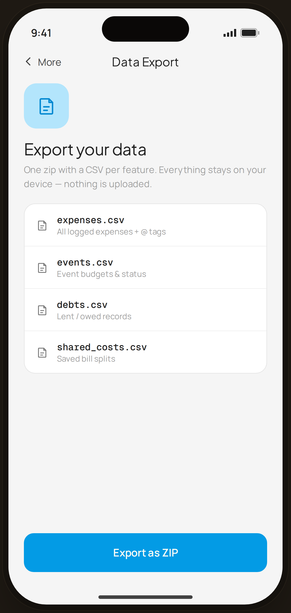

# Data Export — Flow 03 · More

`more-export` · artboard 414×868

## Purpose
Export all local data as a ZIP of CSVs (`<MoreDataExport />`). Reinforces the offline/local-only promise.

## Layout (top → bottom)
- Phone chrome.
- **NavBar** — back "‹ More", center "Data Export".
- Scroll body: 64px blue-tint icon tile; serif 23px "Export your data"; body about one zip / nothing uploaded; a card listing the 4 CSV files (mono filename + description).
- **Bottom CTA**: primary "Export as ZIP", full-width.

## Components & content
- Copy: `Data Export`, `Export your data`, `One zip with a CSV per feature. Everything stays on your device — nothing is uploaded.`, `Export as ZIP`.
- Files: `expenses.csv` (All logged expenses + @ tags), `events.csv` (Event budgets & status), `debts.csv` (Lent / owed records), `shared_costs.csv` (Saved bill splits).

## Typography & color
- Title `--serif` 23px; filenames `--mono` 13.5px 500 `--ink`; descriptions 11.5px `--muted`.
- Icon tile blue-100 / blue-700. CTA `--clay` #039be5.

## States & interactions
- Static; "Export as ZIP" would generate and share the archive. File list is informational.

## Implementation notes
- `files[]` array local. Reuses `PhoneShell`, `NavBar`, `BackBtn`, `Button`, `Icon`.
