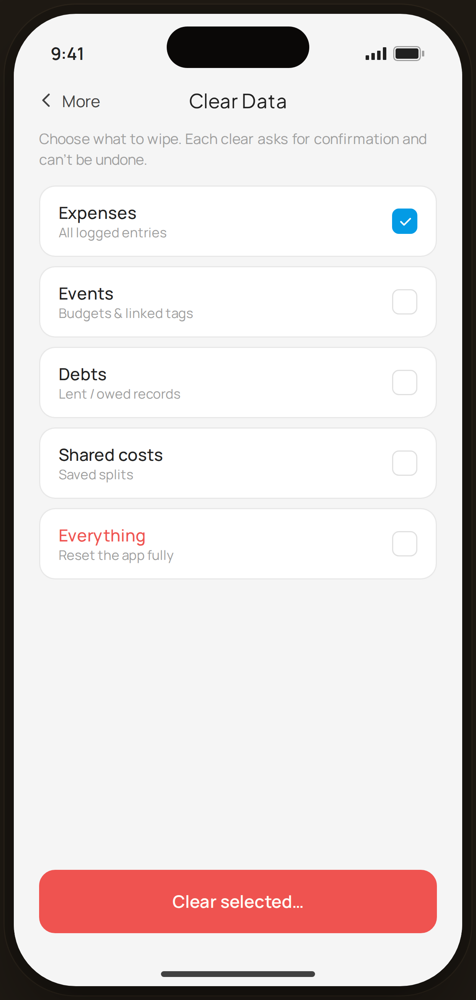

# Clear Data — Flow 03 · More

`more-clear` · destructive · artboard 414×868

## Purpose
Selectively wipe local data (`<MoreClearData />`). A destructive settings screen with per-scope checkboxes and a red action.

## Layout (top → bottom)
- Phone chrome.
- **NavBar** — back "‹ More", center "Clear Data".
- Scroll body: warning line, then 5 selectable rows (label + sub + checkbox): Expenses (checked), Events, Debts, Shared costs, Everything (red label).
- **Bottom CTA**: primary button styled **danger red** — "Clear selected…".

## Components & content
- Copy: `Clear Data`, `Choose what to wipe. Each clear asks for confirmation and can't be undone.`, options `Expenses` (All logged entries), `Events` (Budgets & linked tags), `Debts` (Lent / owed records), `Shared costs` (Saved splits), `Everything` (Reset the app fully), CTA `Clear selected…`.

## Typography & color
- Row label `--sans` 14.5px 500; "Everything" label `--danger` #ef5350.
- Checked box: `--blue-500` fill with white check; unchecked `--line-strong` outline.
- CTA background/border `--danger` #ef5350 (overrides primary).

## States & interactions
- Multi-select checkboxes (Expenses pre-checked). Tapping "Clear selected…" opens a confirm dialog (can't be undone). Each clear is irreversible.

## Implementation notes
- `opts[]` array local; only first checked. Reuses `PhoneShell`, `NavBar`, `BackBtn`, `Button` (danger override), `Icon`.
