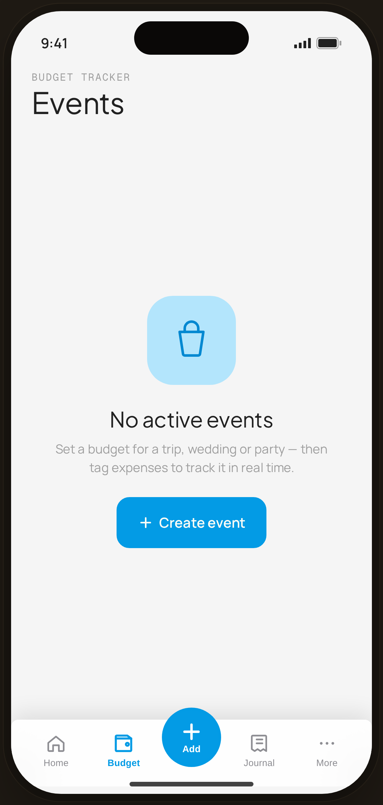

# Events · empty (fresh) — Flow 06 · Event Budget

`event-empty` · artboard 414×868

## Purpose
The Events tab with no events yet (`<ScreenEventEmptyHi />`). Zero-state that explains the feature and offers to create the first event.

## Layout (top → bottom)
- Phone chrome.
- **Header** (14×22): mono "BUDGET TRACKER"; serif 32px "Events".
- **Empty block** (flex-1, centered, 40px side padding): 96px blue-tint rounded square with events icon; serif 23px "No active events"; body "Set a budget for a trip, wedding or party — then tag expenses to track it in real time."; primary "＋ Create event" button.
- **Floating bottom nav** (`active="budget"`).

## Components & content
- Copy: `BUDGET TRACKER`, `Events`, `No active events`, `Set a budget for a trip, wedding or party — then tag expenses to track it in real time.`, `Create event`.
- DS components: `Button` primary/lg with leading ＋ icon.

## Typography & color
- Title `--serif` 32px; empty title `--serif` 23px; body `--muted`.
- Icon tile blue-100 / blue-700; CTA `--clay` #039be5.

## States & interactions
- Zero state. "Create event" opens the create sheet (`event-create`).

## Implementation notes
- Static. Reuses `PhoneShell`, `ProtoBottomNav`, `Button`, `Icon`.
