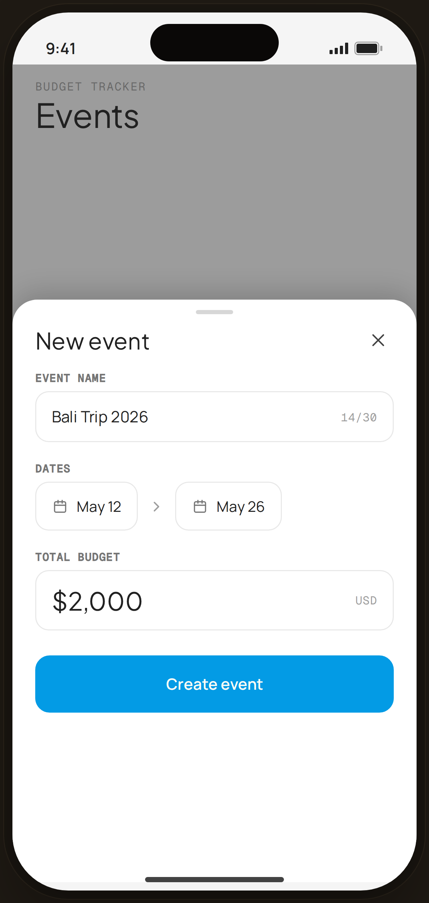

# Create event · filled — Flow 06 · Event Budget

`event-create` · artboard 414×868

## Purpose
The "New event" creation sheet in its filled, valid happy-path state (`<ScreenEventCreateHi />`).

## Layout (top → bottom)
- Phone chrome with the Events list dimmed behind (mono "BUDGET TRACKER" / serif "Events" header).
- **Bottom sheet** (`EdgeBottomSheet`, height 560) over scrim:
  - Handle + title "New event" + close.
  - **Event name** field — "Bali Trip 2026" with mono "14/30" counter.
  - **Dates** — two date fields ("May 12" → "May 26") with a connecting arrow.
  - **Total budget** field — serif "$2,000" + mono "USD".
  - **Create event** primary button (enabled).

## Components & content
- Copy: `New event`, `Event name`, `Bali Trip 2026`, `14/30`, `Dates`, `May 12`, `May 26`, `Total budget`, `$2,000`, `USD`, `Create event`.
- DS components: `Button` primary/lg/fullWidth; local `Field`, `SheetLabel`.

## Typography & color
- Field labels `--mono` 10.5px uppercase `--ink-3`; budget value `--serif` 24px `--ink`.
- All fields `--card` w/ `--line` (valid, no error state). CTA `--clay` #039be5.

## States & interactions
- Valid form → "Create event" enabled. Error variant (＄0 budget + duplicate name) is `edge-event-errors`. Tapping fields opens pickers in the interactive build.

## Implementation notes
- All values hard-coded. Reuses `PhoneShell`, `EdgeBottomSheet`, `Field`, `Button`, `Icon`.
